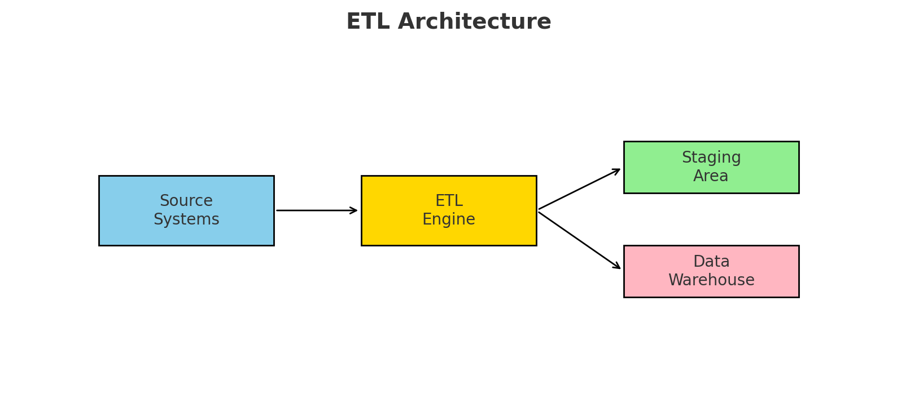
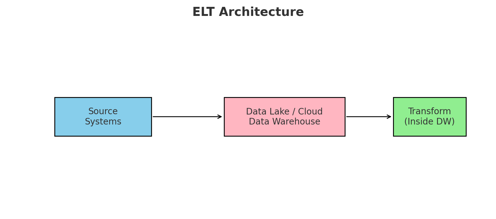

Great question! Let’s break down **ETL (Extract–Transform–Load)** and **ELT (Extract–Load–Transform)** in detail, covering their **architectures, features, use cases, advantages/disadvantages, and when/where to use**.

---

# 🔹 ETL vs ELT

## 1. **ETL (Extract – Transform – Load)**

👉 Data is **extracted** from sources → **transformed** into the required format → **loaded** into a target (data warehouse / data mart).

### 📌 Architecture of ETL

```
[Source Systems] → [ETL Tool / Engine] → [Staging Area] → [Data Warehouse / Data Mart]
```

* **Extract**: Pulls data from sources (databases, APIs, flat files, etc.).
* **Transform**: Cleanses, aggregates, standardizes, applies business logic (done in ETL server/middleware).
* **Load**: Loads transformed data into a target system (OLAP databases, data warehouses like Teradata, Oracle, SQL Server).

### 📌 Features of ETL

* Transformation happens **before loading** into the target.
* Best for **structured data**.
* Data is usually stored in a **staging area** first.
* Traditionally used with **on-premise data warehouses**.
* ETL tools: Informatica, Talend, SSIS, DataStage.

### 📌 When to Use ETL

* When data **volume is moderate** (not huge like petabytes).
* When you need **complex transformations** before loading.
* When using **traditional warehouses** (Oracle, Teradata, SQL Server).
* When regulatory needs require **only clean, curated data** to enter the warehouse.

---

## 2. **ELT (Extract – Load – Transform)**

👉 Data is **extracted** from sources → **loaded directly into target storage (data lake / cloud DW)** → **transformed within the target system**.

### 📌 Architecture of ELT

```
[Source Systems] → [Data Lake / Cloud DW (Snowflake, BigQuery, Databricks)] → [Transform inside DW]
```



* **Extract**: Same as ETL (pulls raw data).
* **Load**: Raw data is **immediately ingested** into the target (data lake / cloud warehouse).
* **Transform**: Uses the **computing power of the DW** (SQL, Spark, Databricks, BigQuery, Snowflake) to process data.

### 📌 Features of ELT

* Transformation happens **after loading** into the target.
* Suited for **big data** and **semi/unstructured data** (JSON, Parquet, Avro).
* No separate staging server needed → staging happens inside the target (lake/warehouse).
* Cloud-native and highly **scalable**.
* ELT tools: Azure Data Factory, dbt, Matillion, Databricks pipelines.

### 📌 When to Use ELT

* When dealing with **large volumes of data (TBs/PBs)**.
* When using **cloud-based data warehouses/lakes** (Snowflake, BigQuery, Databricks Delta Lake, Synapse).
* When **schema-on-read** approach is needed (raw data stored first, transformed later).
* When flexibility is required → store raw data first, decide transformations later.

---

# 🔹 Key Differences: ETL vs ELT

| Aspect               | **ETL**                                | **ELT**                                          |
| -------------------- | -------------------------------------- | ------------------------------------------------ |
| **Process Order**    | Extract → Transform → Load             | Extract → Load → Transform                       |
| **Transform Engine** | ETL server / middleware                | Inside DW (SQL, Spark, etc.)                     |
| **Best for**         | Structured data, smaller volumes       | Big data, structured + semi/unstructured         |
| **Latency**          | Batch-oriented, slower for huge data   | Near real-time, supports streaming               |
| **Target**           | On-prem DWs (Oracle, Teradata, SQL DW) | Cloud DWs/Lakes (Snowflake, Databricks)          |
| **Storage**          | Limited, only curated data in DW       | Raw + curated data both can be stored            |
| **Scalability**      | Limited by ETL server capacity         | Highly scalable (uses DW power)                  |
| **Tools**            | Informatica, SSIS, Talend, DataStage   | ADF, dbt, Matillion, Databricks, Snowflake tasks |

---

# 🔹 Where to Use ETL vs ELT

✅ **Use ETL**

* Traditional BI and reporting with on-prem warehouses.
* Industries like Banking, Insurance, Healthcare with **heavy compliance** (only clean data in DW).
* When transformation logic is complex and needs dedicated ETL tools.

✅ **Use ELT**

* Modern cloud data platforms (Azure Synapse, Snowflake, BigQuery, Databricks).
* IoT, Social Media, E-commerce with **large streaming/semi-structured data**.
* When you want a **data lake + data warehouse hybrid** approach.
* When you need **real-time analytics** and scalability.

---

# 🔹 Quick Analogy

* **ETL** = Like washing vegetables **before putting them in the fridge** (clean data only goes in).
* **ELT** = Like putting vegetables **directly in the fridge** and washing/cutting them when you cook (store raw data, transform later as needed).

---

