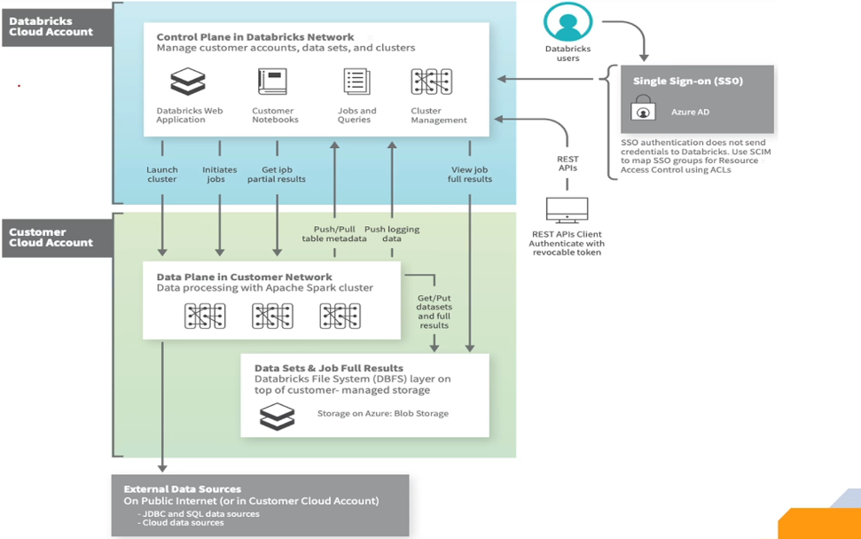

### Question 2: What is the difference between Spark, Databricks, and PySpark?
1. Apache Spark:
    - Definition: An open-source framework used for big data analytics.
    - Purpose: Designed for distributed processing and in-memory computations.
    - Accessibility: Free to use for both personal and commercial purposes.
    - Functionality: Provides the core engine for big data processing.
2. Databricks:
    - Definition: A platform built on top of Apache Spark, developed by the creators of Spark.
    - Optimization: The Databricks runtime offers additional optimizations, claiming up to five times better performance than standard Spark.
    - Additional Features: Includes extra functionality specific to Databricks, while maintaining full compatibility with Spark.
    - Use Case: Ideal for teams seeking enhanced performance and ease of use with Spark-based workflows.
3. PySpark:
    - Definition: A Python library that enables writing Spark code using Python.
    - Dependency: PySpark must be installed to execute Python-based Spark code.
    - Purpose: Facilitates the use of Python (a popular language for data analytics and machine learning) in Spark projects.
    - Compatibility: Works seamlessly with Apache Spark and Databricks environments.

**Answer:** The main differences between transformations and actions in Spark are as follows:
1. Definition:
    - Transformation: A function that modifies data by creating a new DataFrame or RDD from an existing one.
    - Action: A function that triggers the execution of transformations and produces a non-DataFrame or non-RDD result.
2. Examples:
    - Transformation: Filtering, selecting, joining, and aggregating data (e.g., .filter(), .select()).
    - Action: Counting, collecting, and saving results (e.g., .count(), .collect(), .save()).
3. Execution:
    - Transformation: Lazily evaluated. Transformations do not execute immediately; they are recorded as a lineage until an action triggers their execution.
    - Action: Actions trigger execution of all preceding transformations in the lineage to produce a result or write data.
4. Output Type:
    - Transformation: Produces another DataFrame or RDD.
    - Action: Produces a final result that is not a DataFrame or RDD (e.g., a scalar value, array, or written output).

### Question 4 : What do you mean by lazy transformations in Spark?
**Answer:** Lazy transformations in Spark refer to a design where transformations are not executed immediately when they are called. Instead, their execution is deferred until an action triggers the computation.
Key Points About Lazy Transformations:
1. Deferred Execution:
    - When a transformation (e.g., .filter(), .map()) is called, Spark does not execute it immediately.
    - The transformation is added to a DAG (Directed Acyclic Graph), which represents the computation lineage.
2. Triggering Execution:
    - Transformations are only executed when an action (e.g., .count(), .collect()) is invoked.
    - Actions prompt Spark to evaluate the DAG, optimize the logical plan, and execute the transformations.
3. Optimization Technique:
    - Lazy transformations allow Spark to optimize the computation pipeline.
    - Spark reduces unnecessary computations by combining multiple transformations into an optimized execution plan.
4. Benefits:
    - Reduces resource consumption by avoiding immediate execution of intermediate steps.
    - Enhances performance through internal optimization of the execution plan.
Example:
If you apply a filter and a map operation to a DataFrame but don’t call an action, Spark will not process the data until you request an output (e.g., by calling .collect()).
Summary:
Lazy transformations are an efficient way to handle big data by deferring execution until required and optimizing the computation pipeline for better performance.

### Question 5: What is the difference between narrow and wide transformations in Spark?
**Answer:** 
1. Narrow Transformation:
    - Definition: Transformations where data processing occurs within the same partition, without requiring data to move across partitions.
    - Characteristics:
        - Can be executed independently for each partition.
        - Faster because there is no data transfer between partitions.
     Examples:
        - Filter, map, union.
     Execution:
        - Each partition can be processed in parallel, resulting in higher performance.

2. Wide Transformation:
    - Definition: Transformations where data processing involves shuffling, i.e., moving data across partitions.
    - Characteristics:
        - Requires data transfer between partitions, resulting in higher computational costs.
        - Involves a shuffle phase where data is redistributed across nodes in the cluster.
    - Examples:
        - GroupByKey, reduceByKey, join.
    - Execution:
        - Data shuffling is time-intensive, especially with large datasets, as it requires both network and computation overhead.

3. Performance Considerations:
    - Narrow Transformation:
        - More efficient and faster due to the absence of shuffling.
        - Ideal for transformations that do not require repartitioning or interdependency among partitions.
    - Wide Transformation:
        - Slower because of the shuffle process, which adds significant overhead.
        - Necessary for operations requiring data aggregation or partition redistribution.

### Question 6: What are RDDs and DataFrames in Spark?
**Answer:** 
1. RDD (Resilient Distributed Dataset):
    - Definition: A fundamental data structure in Spark representing a distributed collection of data, spread across multiple machines in a cluster.
    - Full Form: Resilient Distributed Dataset.
    - Characteristics:
        - Provides low-level APIs for distributed data processing.
        - Immutable and fault-tolerant.
        - Operates on data partitioned across the cluster.
    - Use Case:
        - Suitable for tasks requiring fine-grained control over data processing.
    - Drawbacks:
        ○-Lack of optimizations, making it less efficient for most use cases.

2. DataFrame:
    - Definition: A higher-level abstraction built on top of RDDs, representing data in a tabular format with rows and columns.
    - Characteristics:
        - Provides a structured representation, similar to tables in relational databases.
        - Optimized for performance with Catalyst optimizer and Tungsten execution engine.
        - Compatible with SQL-like operations for easier data manipulation.
    - Use Case:
        - Preferred for most data processing tasks due to its efficiency and ease of use.
    - Advantages:
        - Simplifies data handling and processing.
        - Supports integration with Spark SQL for querying data.

3. Key Differences:
    - Feature	RDD	DataFrame
    - Representation	Distributed collections	Tabular (rows and columns)
    - Ease of Use	Requires manual handling	Higher-level, SQL-like APIs
    - Performance	Less optimized	Automatically optimized
    - Usage	Fine-grained transformations	High-level data manipulation
    - Preferred	Older API	Recommended from Spark 2.0+

4. Current Recommendation:
    - With Spark 2.0 and later versions, DataFrames are the preferred API due to their optimization and simplicity.
    - RDDs are considered low-level and are generally used only when specific custom operations are required that DataFrames cannot handle.

### Question 7: What do you mean by partitions in Spark?
**Answer:** A partition in Spark is a piece or chunk of data stored on the worker nodes in a cluster. It represents the unit of parallelism in Spark, allowing data to be divided and processed across multiple nodes.
    • The number of partitions is influenced by the cluster configuration and application requirements.
    • While users have some control over partitioning (e.g., specifying the number of partitions), they do not have full control.
    • Partitioning can be done using different mechanisms, with hash partitioning (default) and range partitioning being the two most common methods.
When data is saved or parallelized in Spark, it is divided into multiple partitions, which are distributed across the worker nodes in the cluster. This ensures efficient storage and computation. For example, a dataset with rows is divided into smaller partitions, each stored on a separate node, facilitating parallel processing.

###  Question 8: What is shuffling in Spark, and when does it occur?
**Answer:** Shuffling in Spark is the process of redistributing data across multiple partitions, causing data movement between executors. This operation is often costly as it involves significant data transfer, consuming time and bandwidth, which can increase the overall runtime and cost of a job.
Key Points:
    • When it occurs:
        ○ Shuffling typically occurs during operations such as joins, aggregations, or any process requiring data from multiple partitions to be grouped together.
    • Process:
        ○ Data from existing partitions is reorganized so that records with the same key are grouped into the same partition in the resultant dataset.
        ○ For instance, if there are partitions P1, P2, P3, and P4, and a join operation is performed, data from each of these partitions will be redistributed among the new partitions.
    • Impact:
        ○ Shuffling involves heavy data movement across the cluster, leading to increased execution time and resource usage.
This redistribution ensures that computations requiring grouped or related data can be performed, but it is an expensive process that should be minimized whenever possible.

###  Question 9: How do you read a file in Databricks or Spark?
**Answer:** In Spark (and Databricks), reading a file is typically the first step in data processing. Spark provides multiple functions to read files in various formats (e.g., CSV, JSON, Parquet, text files). The process remains the same whether you’re using Spark or Databricks.

Steps to Read a File:
    1. File Formats Supported:
Spark can read files in formats like CSV, JSON, Parquet, text files, etc.
    2. Basic Methods for File Reading:
        ○ Using specific file format functions:	spark.read.csv("path/to/csv_file", header=True)
spark.read.json("path/to/json_file")
spark.read.text("path/to/text_file")
        Using the format method:	spark.read.format("csv") \
    .option("header", True) \
    .load("path/to/csv_file")
    3. Customization Parameters:
        ○ header: Specifies if the first line contains column names (True or False).
        ○ multiline: Handles multi-line records in files.
        ○ Other options like delimiter and schema can also be used.
    4. Example in Databricks:
        ○ Uploading a file:
Use Databricks' UI to upload the file. Databricks provides commands to access the file path.
        ○ Loading the file:	# Example: Reading a CSV file with a header
df = spark.read.format("csv") \
    .option("header", True) \
    .load("/path/to/uploaded_file.csv")
df.show()
    5. Previewing Data:
After loading the file, use methods like .show() or .printSchema() to inspect the data.

Key Takeaways:
    • Spark provides flexible methods to read various file types.
    • Use specific functions like read.csv or the more general read.format with appropriate options based on the file structure.
    • The process is consistent in Databricks, with additional ease of file upload and management.

### Question 10 What does inferSchema do while reading a file?

**Answer:**  The inferSchema option in Spark scans the input file to automatically detect and define the schema (data types) for each column. This feature is useful when the data types of the columns are unknown or dynamic.

Functionality of inferSchema:
    1. How it works:
        ○ inferSchema examines the file from top to bottom and predicts the most appropriate data type for each column (e.g., string, integer, double).
        ○ By default, inferSchema is set to false, which means all columns are read as strings.
    2. How to enable:
To enable schema inference, set inferSchema=True while reading the file. For example:
df = spark.read.format("csv") \
    .option("header", True) \
    .option("inferSchema", True) \
    .load("path/to/file.csv")
df.printSchema()

Advantages of inferSchema:
    • Automatically determines data types for columns, reducing manual effort.
    • Useful for files where the schema is unknown or constantly changing.

Disadvantages of inferSchema:
    • Performance impact:
        ○ Enabling inferSchema for large files (e.g., 100GB) can slow down the process, as Spark must scan the entire dataset to determine column types.
    • Default behavior:
        ○ To avoid performance overhead, inferSchema is disabled (False) by default.

When to Use inferSchema:
    • Use it when:
        ○ You are unsure about the schema of the file.
        ○ The schema of the file changes frequently.
    • Avoid it when:
        ○ You already know the schema.
        ○ You are working with large datasets where execution time is critical. Instead, define the schema explicitly to improve performance.

Example in Databricks:
    1. Default Behavior (inferSchema=False):
df = spark.read.format("csv") \
    .option("header", True) \
    .load("path/to/file.csv")
df.printSchema()
        ○ All columns will have the string data type.
    2. Enabling inferSchema=True:
df = spark.read.format("csv") \
    .option("header", True) \
    .option("inferSchema", True) \
    .load("path/to/file.csv")
df.printSchema()
        ○ Columns will have the correct data types (e.g., integer, double, etc.).
By enabling inferSchema, Spark will intelligently infer the schema, but use it judiciously to avoid unnecessary performance costs.

---

### Question 11: What is the need of a broadcast variable in Spark?
Answer:
A broadcast variable in Spark is used to optimize the distribution of a read-only value or dataset across all nodes in a cluster. Its primary purposes include:
    1. Caching Read-Only Data: Broadcast variables allow a programmer to cache data on each node of the cluster, making it readily available for all tasks running on those nodes. This reduces the need to repeatedly transfer the data across nodes, saving on communication costs.
    2. Improving Join Performance: In scenarios where one table is small and the other is large, broadcast variables enable broadcast joins, which are more efficient and faster than traditional joins.
    3. Efficient Distribution: Spark uses a specialized broadcast algorithm to transfer broadcast variables to multiple nodes efficiently, reducing overall communication overhead.
The mechanism ensures that the data required by all tasks is readily available locally on each node, avoiding redundant transfers and thereby optimizing performance.

### Question 12: What are the different ways to define the schema in Spark, and why is it recommended?
Answer:
Ways to Define the Schema:
    1. Programmatic Manner:
        ○ Uses built-in Spark functions and data types (e.g., StringType, IntegerType, StructType, StructField) to define the schema in code.
        ○ Example:
from pyspark.sql.types import StructType, StructField, StringType, IntegerType
schema = StructType([
    StructField("column1", StringType(), True),
    StructField("column2", IntegerType(), False)
])
        ○ The schema is passed explicitly when reading a file to define the column names, data types, and nullability.
    2. Declarative Manner:
        ○ Suitable for users from a SQL background.
        ○ The schema is defined in a format resembling SQL (e.g., specifying column names and data types in a structured string).
        ○ Example:
schema = "column1 STRING, column2 INT"
Why Schema Definition Is Recommended:
    1. Improved Performance:
        ○ Inferring schema, especially for large datasets, can be computationally expensive and slow. Defining the schema manually eliminates this overhead.
    2. Data Validation:
        ○ Ensures that the data adheres to the expected structure and types, reducing errors during processing.
    3. Consistency:
        ○ Guarantees consistent data interpretation regardless of the input file's format or variations.
    4. Flexibility:
        ○ Custom schemas allow precise control over the data structure, enabling better compatibility with downstream operations or integrations.

### Question 13: What is Spark SQL?
Answer:
Spark SQL is a module in Apache Spark designed for structured data processing. It allows users to perform transformations and analysis using SQL syntax.
Key Features of Spark SQL:
    1. Structured Data Processing:
        ○ Enables querying structured and semi-structured data using SQL queries.
    2. Data Abstractions:
        ○ Provides abstractions like DataFrames and Datasets for easier manipulation of structured data.
        ○ Acts as a distributed SQL query engine for large-scale data.
    3. SQL Query Support:
        ○ Allows users to write transformation logic in SQL syntax, making it accessible to developers and analysts with an SQL background.
    4. Integration with Other Spark Modules:
        ○ Works seamlessly with Spark Core, Spark Streaming, and other modules.
    5. User-Friendly:
        ○ Designed to cater to SQL professionals, data analysts, and developers, reducing the learning curve for working with big data.
Purpose of Spark SQL:
    • To make Spark accessible to a broader audience by supporting SQL-style operations.
    • To enable a unified approach for structured data handling in big data applications.

### Question 14: How can you create temporary views in Spark, and what are their characteristics?
Answer:
Creating Temporary Views in Spark:
Temporary views allow you to perform SQL operations on DataFrames in Spark. They can be created using the following methods:
    1. createOrReplaceTempView(viewName):
        ○ Creates a temporary view with the given name, replacing any existing view with the same name.
        ○ Example:
dataframe.createOrReplaceTempView("orders")
    2. createTempView(viewName):
        ○ Creates a temporary view without replacing an existing view. If a view with the same name already exists, this method will raise an error.
        ○ Example:
dataframe.createTempView("orders")
Querying the Temporary View:
Once the temporary view is created, you can execute SQL queries using the spark.sql function.
Example:

result = spark.sql("SELECT * FROM orders")
result.show()
Characteristics of Temporary Views:
    1. Session-Scoped:
        ○ Temporary views exist only for the duration of the session. They are dropped automatically when the session ends.
    2. Not Persistent:
        ○ Definitions of temporary views are not stored in metadata or external storage.
    3. Purpose:
        ○ Useful for running ad-hoc SQL queries or transformations during interactive sessions or within a single notebook/script.
    4. Name Collision:
        ○ If you use createTempView and attempt to create a view with the same name again, it will throw an error. Use createOrReplaceTempView to avoid this issue.
By leveraging temporary views, you can easily transition between DataFrame operations and SQL queries, enhancing flexibility in Spark workflows.

### Question 15: How can you create global views in Spark, and what are their characteristics?
Answer:
Creating Global Views in Spark:
Global views in Spark are designed to share data across multiple sessions and notebooks within a cluster. They are created using the following method:
    1. createOrReplaceGlobalTempView(viewName):
        ○ Creates a global temporary view that resides in the global_temp schema.
        ○ Example:
dataframe.createOrReplaceGlobalTempView("orders")
Querying a Global View:
Since global views are stored in the global_temp schema, you must include the schema name in your query.
Example:
result = spark.sql("SELECT * FROM global_temp.orders")
result.show()
Characteristics of Global Views:
    1. Schema-Based:
        ○ Global views are stored in a reserved schema called global_temp.
        ○ Queries must reference this schema (e.g., global_temp.view_name).
    2. Shared Across Sessions:
        ○ Unlike temporary views, global views are accessible across multiple sessions and notebooks within the same cluster.
    3. Session-Limited Lifetime:
        ○ Although global views can be shared across sessions, they are still temporary and will be dropped when the cluster stops.
    4. Use Case:
        ○ Ideal for sharing common data or intermediate results among multiple users or notebooks in a cluster.
Checking Global Views:
You can list all global views using:

SHOW VIEWS IN global_temp;
By leveraging global views, you can efficiently share and reuse data transformations across different parts of your Spark application.

### Question 16: What are the magic commands in Databricks, and when should you use them?
Answer:
Magic Commands in Databricks:
Magic commands in Databricks are special commands that allow you to switch between different languages or functionalities within a notebook cell, regardless of the notebook's default language. They are particularly useful for executing specific tasks or running code in different languages seamlessly.

Types of Magic Commands:
    1. Language-Specific Magic Commands:
        ○ %python: Converts the cell to Python code.
        ○ %scala: Converts the cell to Scala code.
        ○ %sql: Converts the cell to SQL.
        ○ %r: Converts the cell to R code.
        ○ Use Case: To execute code in a language different from the notebook's default language.
Example:
%sql
SELECT current_database();
    2. File System Operations:
        ○ %fs: Allows interaction with the Databricks file system (DBFS).
        ○ Use Case: To perform file system operations like listing files, copying, or deleting files.
Example:
%fs ls /databricks-datasets/
    3. Shell Commands:
        ○ %sh: Executes shell commands.
        ○ Use Case: To run shell-level commands for tasks like installing packages or checking system information.
Example:
%sh
ls
    4. Markdown:
        ○ %md: Converts the cell into a markdown cell.
        ○ Use Case: For writing notes, documentation, or descriptions directly in the notebook.
Example:
%md
# This is a markdown heading
**Bold text**
    5. Running Notebooks:
        ○ %run: Executes another notebook from within the current notebook.
        ○ Use Case: To reuse code or workflows defined in another notebook.
Example:
%run ./path/to/other_notebook

Advantages of Magic Commands:
    1. Flexibility:
        ○ Run code in multiple languages within a single notebook.
    2. Integration:
        ○ Easily switch between SQL queries, Python transformations, and markdown documentation.
    3. Efficiency:
        ○ Simplify file system or shell interactions without leaving the notebook environment.
    4. Reusability:
        ○ Use %run to modularize and reuse code across notebooks.

By using these magic commands, you can enhance the functionality and interactivity of your Databricks notebooks, making them versatile and powerful tools for data engineering, analysis, and collaboration.

### Question17: How would you call a notebook from another notebook in Databricks?
Answer:
Calling a Notebook from Another Notebook:
In Databricks, you can call one notebook from another using the %run magic command. This command allows you to include the code and functions of one notebook in another, enabling modularization and reuse of common functionality.

Steps to Call a Notebook:
    1. Create the Notebook to be Called (Child Notebook):
        ○ Define any functions, variables, or setup code in this notebook.
Example:
# Child Notebook: child_notebook
def hello():
    return "Hello from child notebook!"
    2. Call the Child Notebook in Another Notebook (Parent Notebook):
        ○ Use the %run magic command as the first line in a cell to include the child notebook.
        ○ Reference the child notebook by its relative path or name.
Example:
%run ./child_notebook
    3. Use the Imported Functions or Variables from the Child Notebook:
        ○ After executing %run, all functions, variables, or code from the child notebook are available in the current notebook.
Example:
# Calling the hello function defined in child_notebook
print(hello())  # Output: Hello from child notebook!

Why Use %run to Call Notebooks?
    1. Code Reusability:
        ○ Share common functions, initialization logic, or cleanup code across multiple notebooks.
    2. Modular Design:
        ○ Organize code into separate notebooks for easier management and maintenance.
    3. Streamlined Workflow:
        ○ Simplify setup or teardown processes by centralizing them in reusable notebooks.

Key Considerations:
    • Execution Order: The child notebook runs entirely before control returns to the parent notebook.
    • Scope: Variables and functions from the child notebook are available globally in the parent notebook after execution.
    • Path Reference: Ensure the path to the child notebook is correct relative to the parent notebook.

This method is particularly useful for structuring large Databricks projects and promoting code reuse and organization.

---

### Question 18: How can you create a cluster in Databricks?
Answer:
To create a cluster in Databricks:
    1. Navigate to the Compute Tab:
        ○ Open the Databricks workspace and go to the Compute tab.
    2. Initiate Cluster Creation:
        ○ Click on the Create Cluster button.
    3. Provide Cluster Details:
        ○ Name: Enter a name for your cluster.
        ○ Cluster Mode: Select the mode (e.g., High Concurrency, Standard, or Single Node).
    4. Select Runtime Version:
        ○ Choose a specific Databricks Runtime version based on your requirements. Each runtime supports different Spark versions.
    5. Configure Auto-Scaling:
        ○ Enable or disable auto-scaling to adjust worker nodes dynamically.
        ○ Set the termination time for inactivity (e.g., stop the cluster after 10 minutes or 2 hours of inactivity).
    6. Worker and Driver Configuration:
        ○ Define the worker node type and the number of minimum and maximum worker nodes.
        ○ Specify the driver node configuration (e.g., machine type).
    7. Create the Cluster:
        ○ Review all configurations and click the Create Cluster button to finalize.
These steps ensure you understand the configuration options when creating a cluster in Databricks, which may be helpful in an interview setting.

### Question 19: How can you see the list of files available inside a database in Databricks using commands and through the UI?
Answer:
You can view the list of files inside a database in Databricks using the following methods:
1. Using Commands
    • DBUtils Function:
Use the following command:
dbutils.fs.ls("<path>")
        ○ Replace <path> with the desired directory path.
        ○ Example:
dbutils.fs.ls("/")
This lists all files and folders in the root directory of DBFS.
    • Magic Command:
Use the %fs magic command:
%fs ls <path>
        ○ Replace <path> with the desired directory path.
        ○ Example:
%fs ls /
2. Through the Databricks UI
    • Data Explorer Tab:
        1. Go to the Data tab in the Databricks workspace.
        2. Click on DBFS (Databricks File System) to browse files and folders.
    • Enable DBFS File Browser (if not visible):
        1. Go to Settings > Admin Console > Workspace Settings.
        2. Locate the DBFS File Browser option.
        3. Enable it if it is not already enabled.
These methods ensure you can browse and validate file contents in your Databricks environment, demonstrating familiarity with both command-line and UI navigation.

### Question 20: What are the different types of clusters in Databricks?
Answer:
Databricks provides two main types of clusters:
1. Interactive Cluster
    • Purpose:
        ○ Used for development and interactive queries.
        ○ Ideal for tasks where users manually type and execute commands in notebooks.
    • Use Case:
        ○ Development and testing phases.
        ○ Running cells or notebooks interactively.
    • Characteristics:
        ○ Requires manual start and stop unless an inactive period is set.
        ○ Runs continuously until stopped or the inactivity timer elapses.
        ○ Typically incurs higher costs due to prolonged usage.
2. Job Cluster
    • Purpose:
        ○ Used for automated and scheduled tasks.
        ○ Designed for production environments to execute jobs or notebooks at specified intervals.
    • Use Case:
        ○ Automated execution of notebooks and workflows.
        ○ Scheduled jobs with minimal manual intervention.
    • Characteristics:
        ○ Starts automatically, executes the job, and shuts down once the job completes.
        ○ More cost-efficient as it only runs for the duration of the job.
Key Difference
    • Interactive Cluster: Best for manual and development work.
    • Job Cluster: Best for automated and production-level executions.
The choice depends on whether the task is related to development or production automation.

### Question 21: What are the different cluster modes in Databricks?
Answer:
Databricks offers three cluster modes:
1. Standard Cluster
    • Purpose:
        ○ Ideal for single-user workloads.
        ○ Supports running analytics and data processing using languages like Python, Scala, R, or SQL.
    • Characteristics:
        ○ Default cluster mode in Databricks.
        ○ Requires a minimum of two nodes (1 driver node + 1 worker node).
        ○ Not recommended for multi-user environments due to shared processes, which may lead to conflicts or failures affecting all users.
2. High Concurrency Cluster
    • Purpose:
        ○ Designed for multi-user environments and low-latency query execution.
    • Characteristics:
        ○ Enables fine-grained resource sharing and efficient utilization of cluster resources.
        ○ Provides better performance and higher security by running user code in separate processes, ensuring failures in one user’s code don’t affect others.
        ○ Supports table access control, allowing users to assign permissions at the table level.
        ○ Suitable for collaborative work and scenarios requiring higher reliability and isolation.
3. Single Node Cluster
    • Purpose:
        ○ Best suited for lightweight testing, proof of concepts (POCs), or workloads that require minimal resources.
    • Characteristics:
        ○ Runs on a single machine with the driver, worker, and executors all on the same node.
        ○ Does not require a separate worker node, unlike the Standard Cluster.
        ○ Inefficient for processing large datasets or multi-user scenarios.
Key Differences
    • Standard Cluster: Best for single-user workloads, requires at least two nodes.
    • High Concurrency Cluster: Best for multi-user environments with enhanced performance, security, and resource management.
    • Single Node Cluster: Best for small-scale testing or POCs with minimal resources.
The choice of cluster mode depends on the workload requirements, user collaboration, and data volume.

### Question:22 What is Delta Lake, and how can Delta tables be created?
Answer:
Delta Lake is an open-source storage layer that enhances the reliability of data lakes. It provides ACID (Atomicity, Consistency, Isolation, Durability) transaction properties, which ensures robust data management. Delta Lake operates on top of existing storage solutions like HDFS, Azure Blob Storage, or Amazon S3, and is compatible with Apache Spark.
Key Features of Delta Lake:
    1. ACID Transactions: Ensures data consistency and reliability.
    2. Time Travel: Allows viewing and rolling back changes, maintaining version histories for auditing and reproducibility.
    3. Insert, Update, Delete Support: Enables operations like merging, updating, and deleting specific rows, which were not possible in traditional data lakes.
Creating Delta Tables:
    1. Load the data into a DataFrame, e.g., from a CSV file.
    2. Use the following command to save the DataFrame as a Delta table:
dataframe.write.format("delta").save("path_to_table")
    3. To verify, use:
DESCRIBE EXTENDED table_name

The output will indicate the provider as "Delta," confirming the creation of a Delta table.

### Question 23: What is the difference between a Data Lake and a Delta Lake?
Answer:
Data Lake
    • Concept: A data lake is a conceptual storage solution where all enterprise-level data is stored in a centralized location.
    • Characteristics: Typically built on storage systems like Amazon S3, HDFS, or Azure Data Lake Storage.
    • Limitations:
        ○ Lacks ACID (Atomicity, Consistency, Isolation, Durability) transaction capabilities.
        ○ Does not support time travel (e.g., viewing previous versions of data).
Delta Lake
    • Framework: Delta Lake is an open-source storage framework that operates on top of an existing data lake.
    • Features:
        ○ Provides ACID transaction properties for reliable data management.
        ○ Supports time travel, enabling access to historical data versions.
        ○ Enhances the capabilities of a standard data lake by adding transactional consistency and advanced features.

### Question 24: Explain the architecture of Databricks.
Answer:
The Databricks architecture is divided into two main components: the Control Plane and the Data Plane.
1. Control Plane (Databricks Cloud Account):
    • Description: This is managed by Databricks and includes all the web applications and management services provided by Databricks.
    • Components:
        ○ Databricks Workspace: Includes the browser-based UI, notebooks, and job scheduling.
        ○ Cluster Management: Handles the creation and configuration of clusters.
        ○ Query Management: Includes query execution and monitoring.
    • Key Characteristics:
        ○ Hosted entirely in the Databricks-managed cloud.
        ○ Users do not have direct access to the control plane.
2. Data Plane (Customer Cloud Account):
    • Description: This is where the user’s data resides and computations occur. It is hosted in the customer’s cloud account.
    • Components:
        ○ Data Storage: Typically resides in cloud storage solutions like Azure Storage, AWS S3, or Google Cloud Storage.
        ○ Clusters: Compute resources (VMs, nodes) are provisioned and managed here for executing workloads.
    • Key Characteristics:
        ○ Users maintain control over their data.
        ○ It is recommended to store data in the customer cloud storage and mount it to Databricks to avoid data loss if the workspace is deleted.
Additional Features:
    • Single Sign-On (SSO): Integration with directory services (e.g., Azure Active Directory) for seamless login.
    • Connectivity: Supports connecting to external databases (e.g., SQL Server) via JDBC or SQL connectors.

### Question 25: What is Hive Metastore?
Answer:
Hive Metastore is a relational database that stores metadata about tables and views in a data processing system like Apache Spark or Hive. It does not store the actual data but rather information about the data.
Key Functions:
    1. Metadata Storage: Stores information such as table names, column names, data types, and schemas.
    2. Default Configuration: When Spark is installed, a default Hive Metastore is automatically configured.
    3. External Configuration: Users can configure external relational databases (e.g., MySQL, Oracle) to serve as the Hive Metastore.
In Databricks:
    • Databricks includes a Hive Metastore to persist metadata for tables and views.
    • Users can configure external Hive Metastores using other relational databases if needed.

### Question 26: How can you automate the execution of a Databricks notebook to run at a specified frequency, such as hourly?
Answer:
To automate the execution of a Databricks notebook, you can follow these methods:
Method 1: Using Databricks Workflows (Preferred Method)
    1. Navigate to your Databricks workspace.
    2. Click on the Workflow tab and select Create Job.
    3. Provide a name for the job.
    4. Select the notebook you want to execute.
    5. Configure the cluster settings to define the resources for execution.
    6. Set the schedule:
        ○ Specify the frequency (e.g., hourly, daily, every 15 minutes).
        ○ Define the start time.
    7. Save the job. The notebook will now run automatically according to the defined schedule.
Method 2: Using Azure Data Factory (ADF)
    1. Create a pipeline in Azure Data Factory.
    2. Add a Databricks Notebook Activity to the pipeline.
    3. Configure the activity to point to the desired Databricks notebook.
    4. Set up a trigger in ADF to define the execution schedule (e.g., hourly, daily).

### Question 27: How would you reuse code developed by another team in Azure Databricks notebooks while following best practices?
Answer:
To reuse code developed by another team in Azure Databricks, follow these best practices:
Scenario 1: Code is in the Same Workspace
    1. Import the Notebook:
        ○ If the other team's code is in a notebook within the same Databricks workspace, you can use the %run command to include that notebook.
        Example:
%run /path/to/the/notebook
        ○ This allows you to access and reuse all the functions and variables defined in the imported notebook.
Scenario 2: Code is in a Different Workspace or External Location
    1. Package the Code:
        ○ Convert the code into a Python library (e.g., .whl file) or a JAR file.
        ○ Package the necessary functions, classes, and logic for reuse.
    2. Upload and Attach to Cluster:
        ○ Upload the library file to the Databricks workspace.
        ○ Attach it to the appropriate cluster(s) in your workspace.
    3. Import the Library:
        ○ Use Python's import or Spark's library utilities to use the packaged code in your notebook.
        ○ Example:
from your_custom_library import some_function

### Question 28: How would you decide which cluster to choose in Databricks?
Answer:
Deciding on the right cluster in Databricks depends on several factors. Here are the key considerations:

1. Cluster Type
    • Interactive Cluster:
        ○ Used for development, testing, and debugging.
        ○ Suitable for collaborative tasks or exploratory work.
    • Job Cluster:
        ○ Used for executing production jobs.
        ○ Typically configured to shut down after the job completes.
2. Cluster Mode
    • High Concurrency:
        ○ Designed for serving multiple concurrent users with shared resources.
    • Single Node Cluster:
        ○ Used for lightweight or local processing tasks.
    • Standard Cluster:
        ○ General-purpose cluster suitable for most workloads.
3. Cluster Sizing
    • Number of Nodes:
        ○ Determined by the size of your data and complexity of the transformations.
        ○ Larger datasets or complex operations (e.g., joins and aggregations) may require more nodes.
    • Instance Type:
        ○ Memory-Optimized Machines:
            § Useful for tasks with heavy shuffling, joins, or aggregations.
            § Reduces the risk of out-of-memory errors.
        ○ Compute-Optimized Machines:
            § Suitable for simpler tasks with fewer memory requirements.
    • Trial and Adjustment:
        ○ Many teams start with a trial-and-error approach to optimize cluster size for their specific workload.
4. Data and Workload Characteristics
    • Size of the Data:
        ○ Large-scale datasets may require clusters with more nodes or higher memory.
    • Nature of the Workload:
        ○ Intensive transformations, aggregations, or machine learning models require more resources.
    • Frequency of Jobs:
        ○ Frequent jobs might need a dedicated, scalable setup, while less frequent jobs could use smaller clusters.
5. Cost Optimization
    • Choose clusters with appropriate power and memory based on the workload to balance performance and cost.

### Question 29: Assume that multiple team members are working on the same notebook. How would you ensure that nobody overwrites each other's work?
Answer:
This is a common scenario in collaborative development. To prevent overwriting issues when multiple team members are working on the same notebook in Databricks, the best practice is to use Git integration. Here's how it works:
1. Enable Git Integration in Databricks
    • Set up Git integration in the Databricks workspace. Supported platforms include GitHub, Azure Repos, and Bitbucket.
    • Each team member can connect their local development environment to the remote repository.
2. Work with Branches
    • Create Individual Branches:
Each team member should create their own branch to work on specific tasks or features.
    • Commit Changes:
Once work is completed, the changes should be committed to the individual branch.
3. Use Pull Requests
    • Raise a Pull Request (PR):
Team members can raise a PR to merge their branch into the main or master branch.
    • Code Review:
The PR can be reviewed by a senior or designated team member to ensure quality and resolve conflicts.
4. Merge Safely
    • After the review, the PR can be merged into the main branch, ensuring that all contributions are integrated without overwriting any changes.
5. Regular Sync
    • Team members should regularly pull updates from the main branch into their local branches to stay in sync with the latest changes.

### Question 30: Can you call a Databricks notebook from Azure Data Factory (ADF)? If yes, how?
Answer:
Yes, it is possible to call a Databricks notebook from Azure Data Factory. Below are the steps to achieve this integration:

Step-by-Step Process
    1. Create a Pipeline in ADF:
        ○ Navigate to your ADF Studio and create a new pipeline.
    2. Add Databricks Notebook Activity:
        ○ In the Activities pane, search for "Databricks."
        ○ Drag and drop the "Databricks Notebook" activity into the pipeline canvas.
    3. Create a Linked Service for Databricks:
        ○ Click on the New option for the Linked Service.
        ○ Select "Azure Databricks" as the type.
        ○ Configure the Linked Service:
            § Databricks Workspace: Provide the workspace details.
            § Authentication: Use an access token for authentication.
            § Generate the access token in Databricks by navigating to:
                □ Settings → User Settings → Generate New Token.
                □ Copy the token immediately, as it will not be available later.
            § Paste the token in the ADF Linked Service configuration.
    4. Configure the Cluster:
        ○ During the Linked Service setup, specify whether to use:
            § New Job Cluster: Creates a new cluster for each execution.
            § Existing Interactive Cluster: Reuses an already running cluster.
    5. Select the Notebook:
        ○ In the notebook activity, specify the notebook path to be executed.
    6. Test the Connection:
        ○ Validate the connection to ensure the configuration is correct.
    7. Add a Trigger:
        ○ Schedule the pipeline execution by adding a trigger. You can set it to run:
            § On a specific schedule (e.g., daily, hourly, etc.).
            § Based on specific events.

### Question 31: If you have a working Databricks notebook and are now required to write the resulting data to Snowflake (or any other destination like MongoDB, Salesforce, or Amazon S3), how would you handle this scenario?
Answer:
There are two primary approaches to handle this scenario:
1. Staging Mechanism (via Intermediate Storage):
This approach involves writing the data to a staging area (like Azure Data Lake Storage or Blob Storage) and then using an external tool like Azure Data Factory (ADF) or Snowpipe to move the data to Snowflake or other destinations.
Steps:
    1. Write Data to Staging Area:
        ○ Use Databricks to save the data into a staging location, such as Azure Data Lake or Blob Storage.
        ○ Example: Save the data as a Parquet or CSV file.
    2. Use Azure Data Factory (ADF):
        ○ Create an ADF pipeline with:
            § Source: The staging location.
            § Sink: The destination (e.g., Snowflake, MongoDB, etc.).
        ○ Use connectors (like Snowflake Connector or MongoDB Connector) to transfer the data.
    3. Optional - Use Snowpipe (For Snowflake):
        ○ Set up Snowpipe in Snowflake to automatically pull data from the staging location into Snowflake.
2. Direct Connection Using Databricks Connectors:
If a direct connection is preferred, you can use Databricks connectors (JDBC/ODBC) for the respective destination.
Steps:
    1. Install Necessary Connector:
        ○ Install the appropriate connector for your destination (e.g., Snowflake Spark Connector, Cosmos DB Connector).
        ○ Add the required JAR files to your Databricks cluster.
    2. Write Data Directly:
        ○ Use the connector in your Databricks notebook to write data directly to the destination.
        ○ Example for Snowflake:
options = {
    "sfURL": "your_snowflake_account.snowflakecomputing.com",
    "sfDatabase": "your_database",
    "sfSchema": "your_schema",
    "sfWarehouse": "your_warehouse",
    "sfRole": "your_role",
    "sfUser": "your_username",
    "sfPassword": "your_password"
}

# Write data to Snowflake
dataframe.write.format("snowflake").options(**options).option("dbtable", "your_table").save()
Key Considerations:
    • Connector Installation: Ensure the correct connector is installed on the cluster.
    • Performance: Direct connection might be slower for very large datasets compared to staging and batch transfer.
    • Data Governance: Staging provides better monitoring and validation before final load.
    • Flexibility: The staging mechanism can be reused for multiple destinations.
By explaining both approaches, you can demonstrate flexibility and a practical understanding of how to handle real-world scenarios.

### Question 32 : What are the situations where you would perform repartitioning in Spark, and why?

Answer:
Repartitioning is a crucial mechanism in Spark to manage the number of partitions in your data for optimal performance. Here are the main scenarios where you would perform repartitioning and the reasons for doing so:

1. Increasing the Number of Partitions:
    • Scenario: Your current job has fewer partitions, resulting in underutilized cluster resources.
    • Reason:
        ○ To increase parallelism: If you have more partitions, Spark can process the data using more tasks simultaneously. For instance:
            § If there are 5 partitions, 5 tasks will run in parallel.
            § If there are 10 partitions, 10 tasks will run in parallel (provided sufficient cores are available).
        ○ To fully utilize your cluster's computational capacity if it is sitting idle due to fewer partitions.

2. Decreasing the Number of Partitions:
    • Scenario: Your dataset has too many small partitions, leading to overhead during task scheduling and execution.
    • Reason:
        ○ To reduce overhead: If you have thousands of tiny partitions, Spark spends more time managing tasks than actually processing data. Reducing partitions ensures better task management.

3. Addressing Skewed Data (Uneven Distribution):
    • Scenario: Some partitions have a significantly larger amount of data compared to others.
    • Reason:
        ○ To balance the workload: Skewed partitions can cause certain tasks to take much longer than others, leading to bottlenecks. Repartitioning helps distribute data more evenly across partitions.

Key Considerations for Repartitioning:
    • Cost of Repartitioning:
        ○ Repartitioning is a shuffle-intensive operation, which can be time-consuming and resource-heavy.
        ○ It should be used when the performance benefits outweigh the overhead cost.
    • Cluster Capacity:
        ○ The number of partitions should align with the available core processors in your cluster. For example, if your cluster can run 100 tasks in parallel, increasing partitions beyond this may not improve performance.

How to Perform Repartitioning in Spark:
You can use the repartition() method to change the number of partitions in your DataFrame:

# Example to increase partitions
df = df.repartition(10)  # This will create 10 partitions
# Example to balance partitions based on a column
df = df.repartition("key_column")  # Partitions data based on key_column
For decreasing partitions, you can use coalesce() (a more efficient operation for reducing partitions without a full shuffle):
# Example to decrease partitions
df = df.coalesce(5)  # This will create 5 partitions

### Question 33 : If you created a Spark SQL table and copied data into it but terminated the cluster, will the table still be accessible? Explain with reasoning.

Answer:
Yes, the table will still be accessible, even if the cluster is terminated. Here's the explanation:
1. Data Storage and Metadata Management in Spark SQL:
    • When you create a table in Spark SQL using commands like CREATE TABLE or SAVE AS TABLE, the following happens:
        ○ Data Storage:
The actual data is stored in the underlying storage layer, typically in a distributed file system like Azure Data Lake Storage (ADLS), Amazon S3, HDFS, or other configured storage.
        ○ Metadata Storage:
The schema and metadata information of the table (e.g., column names, data types, location of data) are stored in Spark’s metastore. If you are using Databricks, the metadata is typically stored in Hive Metastore or Unity Catalog.
2. Cluster Termination:
    • When a cluster is terminated:
        ○ The data in the storage layer remains unaffected, as it is independent of the cluster's lifecycle.
        ○ The metadata in the metastore also remains intact unless explicitly deleted or modified.
3. Accessibility After Cluster Termination:
    • To access the table again:
        ○ Restart or Create a New Cluster: A new or restarted cluster can connect to the same metastore and storage layer.
        ○ Query the Table: Once the new cluster is connected, you can query the table because the metadata still points to the data in the storage layer.
Example Workflow:
1. Create Table and Add Data:

        CREATE TABLE sample_table (id INT, name STRING);
        INSERT INTO sample_table VALUES (1, 'Alice'), (2, 'Bob');

Data is stored in ADLS or S3, and metadata is saved in the metastore.

2. Terminate the Cluster: The cluster is terminated or deleted.
3. Create or Restart a Cluster: A new cluster is started and connected to the same metastore.
4. Query the Table: Use the new cluster to access the table:

    SELECT * FROM sample_table;

The data and schema will be accessible as before.
Key Notes:
    • The table remains accessible as long as:
        1. The underlying storage (e.g., ADLS or S3) is not deleted.
        2. The metadata in the metastore remains intact.
    • If the metastore is external (e.g., Hive or Unity Catalog), you can recreate clusters without any loss of metadata. However, if you’re using an in-memory or temporary metastore, the metadata is lost upon cluster termination.

