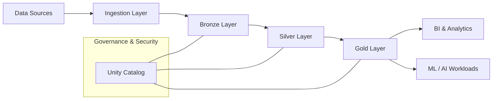

## Azure Databricks + ADLS Gen2 + Unity Catalog

### Enterprise Lakehouse Architecture


---

## 🧩 Architecture Overview

This architecture implements a **governed Lakehouse** using **Azure Databricks**, **Azure Data Lake Storage Gen2**, and **Unity Catalog** to enable scalable analytics, security, and data governance.

---

## 🏗️ High-Level Architecture (Markdown Diagram)



---

## 🔹 Component-Wise Breakdown

### 1️⃣ Data Sources

* OLTP Databases (SQL Server, Oracle)
* SaaS (SAP, Salesforce)
* Streaming (Kafka, Event Hub)
* Files (CSV, JSON, Parquet)

---

### 2️⃣ Ingestion Layer (Azure Databricks)

* Batch ingestion (Spark, JDBC)
* Streaming ingestion (Auto Loader)
* Incremental & CDC-based loads
* Schema evolution support

**Tools**

* Databricks Jobs
* Spark Structured Streaming

---

### 3️⃣ Storage Layer – ADLS Gen2

**Azure Data Lake Storage Gen2**

| Layer  | Purpose                   |
| ------ | ------------------------- |
| Bronze | Raw, immutable data       |
| Silver | Cleaned, conformed data   |
| Gold   | Business-ready aggregates |

* Delta Lake format
* Partitioning & Z-Ordering
* ACID transactions

---

### 4️⃣ Processing Layer – Azure Databricks

**Azure Databricks**

* Distributed Spark compute
* SQL, PySpark, Scala support
* Auto-scaling clusters
* Job & workflow orchestration

---

### 5️⃣ Governance Layer – Unity Catalog

**Unity Catalog**

**Capabilities**

* Centralized metadata management
* Fine-grained RBAC (table, column, row)
* Data lineage (end-to-end)
* Audit logs
* Cross-workspace governance

```text
Catalog
 └── Schema
     └── Tables / Views / Functions
```

---

### 6️⃣ Consumption Layer

* Power BI / Tableau
* Databricks SQL Warehouse
* ML Models (MLflow)
* APIs & downstream apps

---

## 🔐 Security Architecture

| Layer      | Security Controls       |
| ---------- | ----------------------- |
| Identity   | Azure AD                |
| Storage    | Managed Identity + ACLs |
| Data       | Unity Catalog RBAC      |
| Network    | Private Endpoints       |
| Encryption | At-rest & In-transit    |

---

## ⚙️ End-to-End Data Flow

```text
Source → Databricks Ingestion → ADLS Bronze
       → Databricks Transform → ADLS Silver
       → Databricks Aggregate → ADLS Gold
       → Governed Access via Unity Catalog
       → BI / ML / Analytics
```

---

## 🚀 Key Benefits

* ✅ Centralized Governance
* ✅ Scalable Lakehouse Architecture
* ✅ Fine-grained Data Security
* ✅ Cost-efficient Storage & Compute
* ✅ Enterprise-ready Compliance

---

## 📌 When to Use This Architecture

* Enterprise analytics platforms
* Regulated industries (Finance, Healthcare)
* Multi-team data environments
* AI/ML at scale
* Power BI + Databricks workloads

---

