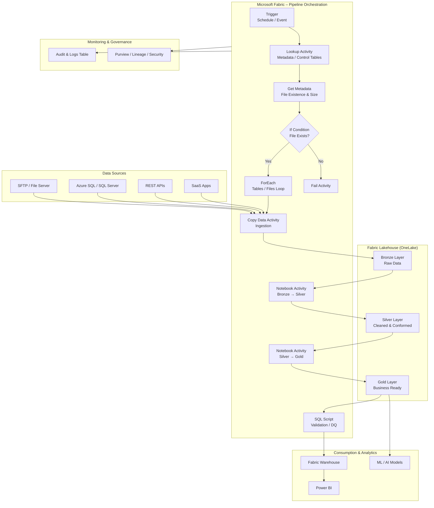

# Microsoft Fabric Pipeline Activities

## Complete Reference Guide (with Static vs Dynamic Parameters)

---

## 1️⃣ What is a Microsoft Fabric Pipeline?

A **Fabric Pipeline** is an orchestration service (successor to Azure Data Factory concepts) used to:

* Ingest data
* Transform data
* Orchestrate notebooks, dataflows, SQL scripts
* Control workflow execution

Fabric pipelines are tightly integrated with:

* **Lakehouse**
* **Warehouse**
* **Dataflows Gen2**
* **Notebooks**
* **Spark & SQL engines**

---

## 2️⃣ Pipeline Activity Categories (High-Level)

| Category             | Purpose                   |
| -------------------- | ------------------------- |
| Data Movement        | Copy & ingestion          |
| Transformation       | Notebook, SQL, Dataflow   |
| Control Flow         | Conditional logic & loops |
| Validation & Utility | Lookup, Wait, Fail        |
| Integration          | Webhooks, REST            |
| Execution Control    | Child pipelines           |

---

## 3️⃣ Data Movement Activities

---

### 🔹 Copy Data Activity

**Purpose:**
Moves data from **source → destination**.

**Supported Sources**

* SFTP
* Azure SQL / SQL Server
* ADLS Gen2
* Blob Storage
* REST API
* Lakehouse tables/files

**Supported Sinks**

* Lakehouse (Files / Tables)
* Warehouse
* ADLS
* SQL DB

#### Parameters

* Source dataset
* Sink dataset
* File format
* Mapping
* Partitioning

**Use Case**

> Ingest daily CSV files from SFTP into Bronze Lakehouse.

**Static Parameter Example**

```text
Source path: /raw/sales.csv
Sink table: bronze_sales
```

**Dynamic Parameter Example**

```text
Source path: /raw/@{formatDateTime(utcNow(),'yyyy-MM-dd')}/sales.csv
```

---

## 4️⃣ Transformation Activities

---

### 🔹 Notebook Activity

**Purpose:**
Executes a **Fabric Spark Notebook**.

**Used For**

* PySpark / SQL transformations
* Delta merge
* Data quality checks
* SCD logic

**Inputs**

* Workspace
* Notebook name
* Parameters

**Static Parameter Example**

```text
table_name = "sales_bronze"
```

**Dynamic Parameter Example**

```text
load_date = @{pipeline().parameters.run_date}
```

**Best Practice**

> Always parameterize environment, paths, and table names.

---

### 🔹 Dataflow Gen2 Activity

**Purpose:**
Runs a **Power Query–based transformation**.

**Used For**

* Low-code transformations
* Schema standardization
* Business logic

**Typical Flow**

```
Source → Transform → Destination
```

**Static**

* Fixed source
* Fixed destination

**Dynamic**

* File path
* Filter date
* Environment switch

---

### 🔹 SQL Script Activity

**Purpose:**
Runs SQL against **Warehouse or Lakehouse SQL endpoint**

**Used For**

* Aggregations
* DDL / DML
* Data validation

**Static Example**

```sql
DELETE FROM silver_sales WHERE sale_date < '2024-01-01'
```

**Dynamic Example**

```sql
DELETE FROM silver_sales 
WHERE sale_date = '@{pipeline().parameters.run_date}'
```

---

## 5️⃣ Control Flow Activities (Very Important)

---

### 🔹 If Condition Activity

**Purpose:**
Runs activities based on conditions.

**Use Case**

> If source file exists → process
> Else → skip pipeline

**Expression Example**

```text
@equals(activity('Lookup_File').output.firstRow.file_exists, true)
```

---

### 🔹 Switch Activity

**Purpose:**
Multiple execution paths based on value.

**Use Case**

> Country-specific logic

```text
Switch on: country_code
Case IN → Notebook_IN
Case US → Notebook_US
```

---

### 🔹 ForEach Activity

**Purpose:**
Loop through an array.

**Use Case**

> Process multiple tables dynamically

**Dynamic Example**

```text
Items: @activity('Lookup_Tables').output.value
```

---

### 🔹 Until Activity

**Purpose:**
Loop until condition is met.

**Use Case**

> Wait for file arrival

---

## 6️⃣ Validation & Utility Activities

---

### 🔹 Lookup Activity

**Purpose:**
Reads data from SQL / Lakehouse table.

**Used For**

* Metadata-driven pipelines
* Control tables
* Config-driven ingestion

**Dynamic Example**

```text
SELECT * FROM pipeline_config WHERE is_active = 1
```

---

### 🔹 Get Metadata Activity

**Purpose:**
Reads file/folder metadata.

**Returns**

* Exists
* Size
* Last modified

**Use Case**

> Validate file availability before copy

---

### 🔹 Wait Activity

**Purpose:**
Pause pipeline execution.

**Use Case**

> Rate limits, dependency waiting

---

### 🔹 Fail Activity

**Purpose:**
Explicitly fail pipeline with custom message.

---

## 7️⃣ Integration & External Activities

---

### 🔹 Web Activity

**Purpose:**
Call REST APIs (GET / POST).

**Use Case**

* Trigger external jobs
* Fetch API data
* Notify systems

**Dynamic Headers Example**

```json
Authorization: Bearer @{pipeline().parameters.token}
```

---

### 🔹 Execute Pipeline Activity

**Purpose:**
Call a **child pipeline**

**Use Case**

> Modular architecture
> Reusable pipelines

**Dynamic Example**

```text
pipelineName = @{item().pipeline_name}
```

---

## 8️⃣ Static vs Dynamic Parameters (Core Concept)

---

### 🔸 Static Parameters

**Defined At**

* Design time

**Characteristics**

* Fixed value
* No runtime evaluation

**Examples**

* Table name
* File format
* Workspace name

**When to Use**
✔ Simple pipelines
✔ POC
✔ Single-source ingestion

---

### 🔸 Dynamic Parameters

**Evaluated At**

* Runtime

**Driven By**

* Expressions
* Lookup results
* Pipeline parameters
* System variables

**Examples**

```text
@utcNow()
@pipeline().parameters.env
@activity('Lookup').output.firstRow.path
```

**When to Use**
✔ Production pipelines
✔ Multi-source ingestion
✔ Metadata-driven frameworks

---

## 9️⃣ Common System Variables in Fabric Pipelines

| Variable              | Purpose             |
| --------------------- | ------------------- |
| pipeline().name       | Pipeline name       |
| pipeline().runId      | Unique execution ID |
| pipeline().parameters | Access parameters   |
| utcNow()              | Current timestamp   |
| item()                | Loop item           |

---

## 🔟 Recommended Fabric Pipeline Design Pattern

```
Trigger
  ↓
Get Metadata / Lookup
  ↓
If Condition (file exists)
  ↓
ForEach (tables/files)
  ↓
Copy Data (Bronze)
  ↓
Notebook (Silver)
  ↓
Notebook (Gold)
  ↓
SQL Validation
```

---

## 1️⃣1️⃣ Best Practices

✔ Use **Lookup-driven pipelines**
✔ Avoid hardcoded paths
✔ Parameterize environment (`dev/test/prod`)
✔ Log audit data in Lakehouse
✔ Use child pipelines for reusability
✔ Handle failure paths explicitly


Below is a **clear, enterprise-grade Microsoft Fabric Pipeline Architecture diagram**, followed by a **layer-by-layer explanation** mapped to real production workloads.

---

## 📐 Microsoft Fabric Pipeline – End-to-End Architecture Diagram



---

## 🧠 Architecture Explanation (Layer by Layer)

---

## 1️⃣ Data Sources Layer

**Purpose:**
Provide raw data to Fabric pipelines.

**Typical Sources**

* SFTP (daily CSV / JSON files)
* Azure SQL / SQL Server
* REST APIs (incremental loads)
* SaaS platforms (CRM, ERP)

✔ Supports **batch & near-real-time ingestion**

---

## 2️⃣ Fabric Pipeline Orchestration Layer

This is the **brain of the architecture**.

### 🔹 Trigger

* Time-based (daily/hourly)
* Event-based (file arrival – limited today)

---

### 🔹 Lookup Activity

* Reads **metadata/control tables**
* Drives dynamic ingestion:

  * Table names
  * File paths
  * Load type (full/incremental)

📌 **Key to metadata-driven pipelines**

---

### 🔹 Get Metadata

* Checks:

  * File existence
  * Size
  * Last modified time

---

### 🔹 If Condition

* Prevents pipeline failure
* Controls execution path

Example:

> If file exists → process
> Else → fail or skip

---

### 🔹 ForEach Loop

* Iterates through:

  * Files
  * Tables
  * API endpoints

📌 Enables **scalable ingestion (50–500+ objects)**

---

### 🔹 Copy Data Activity

* Ingests data into **Bronze layer**
* Handles:

  * Schema mapping
  * Partitioning
  * Compression

---

### 🔹 Notebook Activities

Used for **heavy transformations**

| Notebook        | Purpose                              |
| --------------- | ------------------------------------ |
| Bronze → Silver | Cleansing, dedup, schema enforcement |
| Silver → Gold   | Aggregation, business logic          |

📌 Uses **Spark + Delta Lake**

---

### 🔹 SQL Script Activity

* Data validation
* Aggregations
* Load Warehouse tables

---

### 🔹 Fail Activity

* Controlled failure with meaningful error messages

---

## 3️⃣ Fabric Lakehouse (OneLake) – Medallion Layers

| Layer  | Purpose                 |
| ------ | ----------------------- |
| Bronze | Raw, immutable data     |
| Silver | Cleaned, conformed data |
| Gold   | Business-ready data     |

✔ Delta format
✔ ACID transactions
✔ Time travel

---

## 4️⃣ Consumption Layer

**Who consumes the data?**

* **Fabric Warehouse** – BI & reporting
* **Power BI** – dashboards
* **ML/AI models** – predictive analytics

📌 Gold layer is the **single source of truth**

---

## 5️⃣ Monitoring, Audit & Governance

### 🔹 Audit Tables

* Pipeline run ID
* Start / end time
* Record counts
* Status

### 🔹 Governance

* Microsoft Purview lineage
* OneLake security
* RBAC & sensitivity labels

---

## 🎯 Why This Architecture Works Well in Fabric

✔ Fully **metadata-driven**
✔ Scales to **enterprise workloads**
✔ Clear **Bronze-Silver-Gold separation**
✔ Cost-efficient (shared OneLake storage)
✔ Strong governance & lineage

---
