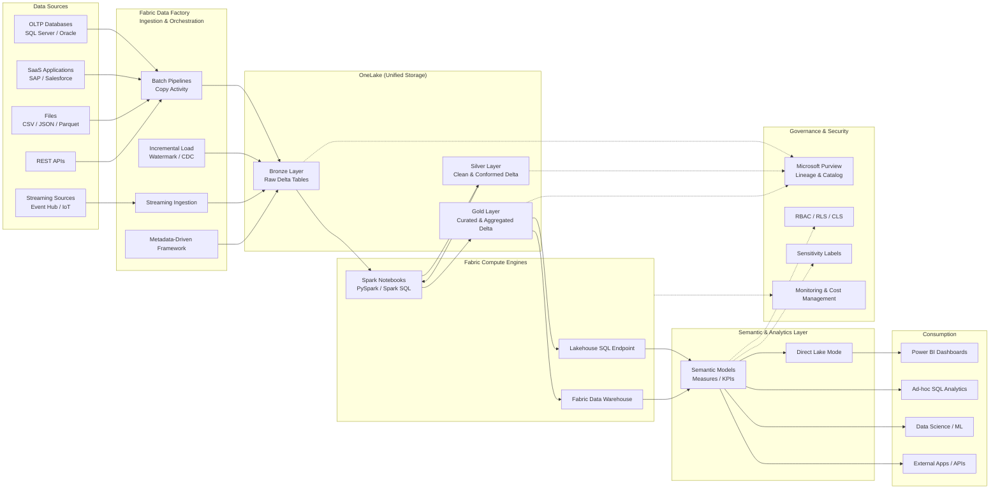
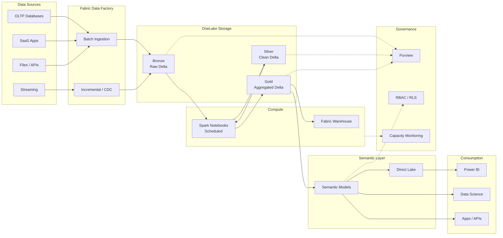

# **End-to-end Microsoft Fabric data flow architecture**

---

## 🔷 Microsoft Fabric – End-to-End Data Flow Architecture

---

## 🧠 How to Explain This in an Interview (30 Seconds)

> “Data is ingested from multiple sources using **Fabric Data Factory** into **OneLake Bronze Delta tables**.
> We transform and clean data using **Spark notebooks** into **Silver**, apply business logic and aggregations in **Gold**, expose it through **semantic models** using **Direct Lake**, and finally consume it in **Power BI and analytics workloads**, all governed centrally via **Microsoft Purview and Fabric security**.”

---

## ✅ Why This Architecture Is Production-Ready

✔ Fully SaaS
✔ No data duplication
✔ Delta-based Lakehouse
✔ BI + AI ready
✔ Central governance
✔ Cost-optimized (Direct Lake)

---

---

# ✅ 1️⃣ Microsoft Fabric – Cost Optimization Checklist (Production-Ready)

### 🔹 Capacity & Billing

* ⬜ Choose **lowest possible F-SKU** initially (scale later)
* ⬜ Separate **Dev / Test / Prod capacities**
* ⬜ Pause Dev/Test capacities outside working hours
* ⬜ Avoid running ad-hoc workloads on Prod capacity
* ⬜ Monitor **Capacity Metrics App** weekly

---

### 🔹 Data Ingestion

* ⬜ Prefer **incremental loads (CDC / watermark)**
* ⬜ Avoid full reloads unless required
* ⬜ Batch ingestion instead of frequent micro-batches
* ⬜ Parameterize pipelines (metadata-driven)

---

### 🔹 Lakehouse & Delta Tables

* ⬜ Use **Bronze / Silver / Gold** layers
* ⬜ Append-only in Bronze
* ⬜ MERGE only in Silver (not Bronze)
* ⬜ Partition by **date / business key**
* ⬜ Avoid overusing `OPTIMIZE` (schedule weekly/monthly)

---

### 🔹 Spark Optimization

* ⬜ Avoid full table scans
* ⬜ Use predicate pushdown
* ⬜ Broadcast small dimension tables
* ⬜ Avoid `.collect()` and `.toPandas()`
* ⬜ Schedule notebooks (no always-on)

---

### 🔹 Power BI & Analytics

* ⬜ Prefer **Direct Lake**
* ⬜ Avoid Import mode unless necessary
* ⬜ Reduce refresh frequency
* ⬜ Pre-aggregate data in Gold layer
* ⬜ Reuse semantic models

---

### 🔹 Governance & Control

* ⬜ Assign workspaces to correct capacity
* ⬜ Apply RLS/CLS at semantic layer (not Spark)
* ⬜ Limit ad-hoc SQL access on Gold tables
* ⬜ Use Purview lineage to track misuse

---

# ✅ 2️⃣ Fabric SKUs vs Workloads (Mapping Table)

| Fabric SKU | Best For         | Typical Workloads                  | Notes              |
| ---------- | ---------------- | ---------------------------------- | ------------------ |
| **F2**     | POC / Learning   | Small ingestion, light BI          | Not for production |
| **F4**     | Dev / Test       | Limited pipelines, small Lakehouse | Pause when idle    |
| **F8**     | Department BI    | Daily ingestion, dashboards        | Most common        |
| **F16**    | Enterprise BI    | Large datasets, concurrency        | Balanced choice    |
| **F32**    | Heavy Analytics  | Streaming + BI + ML                | Costly if misused  |
| **F64+**   | Large Enterprise | High concurrency, real-time        | Needs governance   |

📌 **Rule**:

> “Scale capacity only when concurrency increases, not data size alone.”

---

# ✅ 3️⃣ Interview Scenario-Based Questions (Cost Focused)

### Q1. Your Fabric cost suddenly doubled. How do you investigate?

**Answer:**

1. Check Capacity Metrics App
2. Identify workload spikes (Spark / BI / SQL)
3. Look for full refresh or bad joins
4. Validate Direct Lake vs Import
5. Scale down or isolate workloads

---

### Q2. Why is Spark the most expensive Fabric workload?

**Answer:**
Because Spark consumes **distributed compute**, causes **shuffle**, and runs **long-lived executors** if not optimized.

---

### Q3. How do you reduce Power BI cost in Fabric?

**Answer:**

* Use Direct Lake
* Reduce refresh frequency
* Pre-aggregate in Gold
* Share semantic models

---

### Q4. Fabric vs Synapse — which is cheaper?

**Answer:**
Fabric is cheaper for **mixed workloads (ETL + BI)** due to **shared capacity** and **no duplicate storage**.

---

### Q5. When would you NOT recommend Fabric?

**Answer:**

* Very heavy ML training
* Advanced Spark tuning needed
* Multi-cloud requirement

---

# ✅ 4️⃣ Fabric vs Databricks – Decision Matrix

| Dimension           | Microsoft Fabric          | Azure Databricks       |
| ------------------- | ------------------------- | ---------------------- |
| Pricing Model       | Capacity-based            | DBU + VM               |
| Cost Predictability | High                      | Medium                 |
| BI Integration      | Native Power BI           | External               |
| Storage             | OneLake (single copy)     | ADLS                   |
| Governance          | Built-in                  | Manual setup           |
| Spark Control       | Limited                   | Full control           |
| ML Workloads        | Medium                    | Advanced               |
| Best For            | Enterprise BI + Analytics | Heavy Data Engineering |

🎯 **Decision Rule**

* **BI + Analytics + Cost control → Fabric**
* **Advanced Spark / ML → Databricks**

---

# ✅ 5️⃣ Cost-Optimized Microsoft Fabric Reference Architecture (MD Code)

---

# 🎯 Final Interview One-Liner (Memorize This)

> “Fabric reduces cost by using a **shared capacity model**, **single-copy OneLake storage**, and **Direct Lake analytics**, eliminating duplicated compute and storage seen in traditional Azure analytics stacks.”

---

