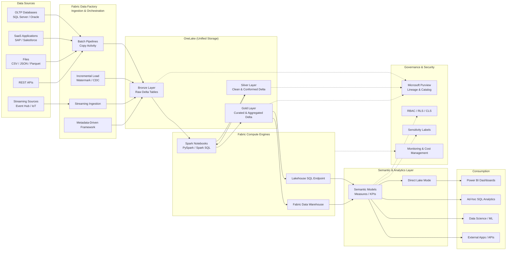

# **End-to-end Microsoft Fabric data flow architecture**

---

## 🔷 Microsoft Fabric – End-to-End Data Flow Architecture

---

## 🧠 How to Explain This in an Interview (30 Seconds)

> “Data is ingested from multiple sources using **Fabric Data Factory** into **OneLake Bronze Delta tables**.
> We transform and clean data using **Spark notebooks** into **Silver**, apply business logic and aggregations in **Gold**, expose it through **semantic models** using **Direct Lake**, and finally consume it in **Power BI and analytics workloads**, all governed centrally via **Microsoft Purview and Fabric security**.”

---

## ✅ Why This Architecture Is Production-Ready

✔ Fully SaaS
✔ No data duplication
✔ Delta-based Lakehouse
✔ BI + AI ready
✔ Central governance
✔ Cost-optimized (Direct Lake)

---

