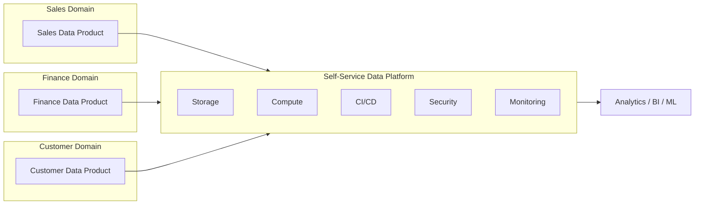
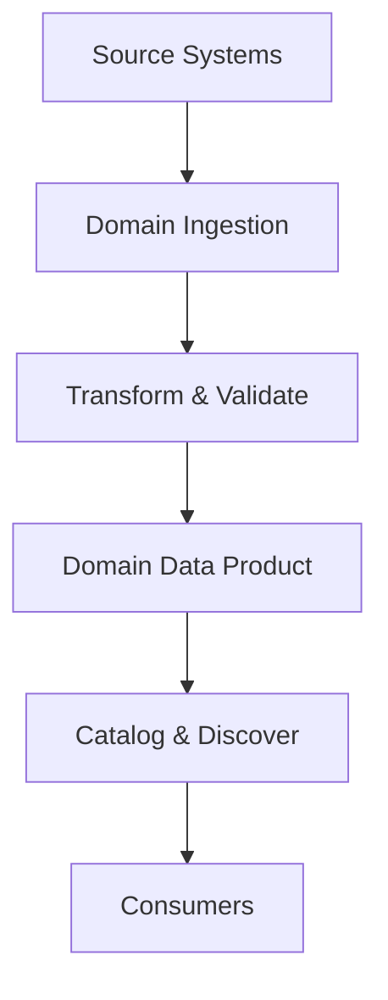
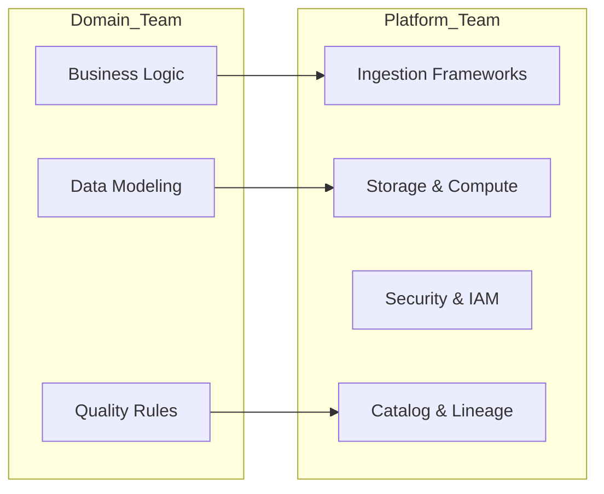
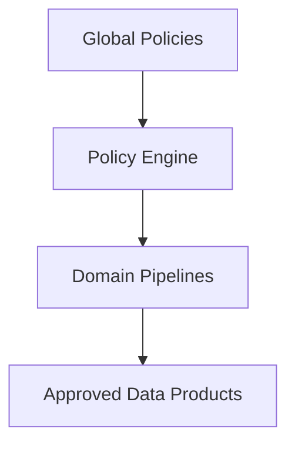
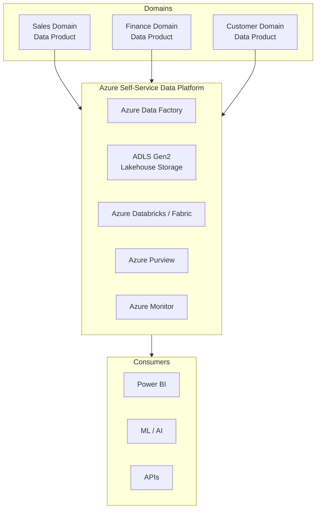
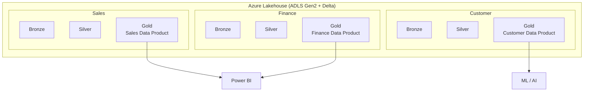
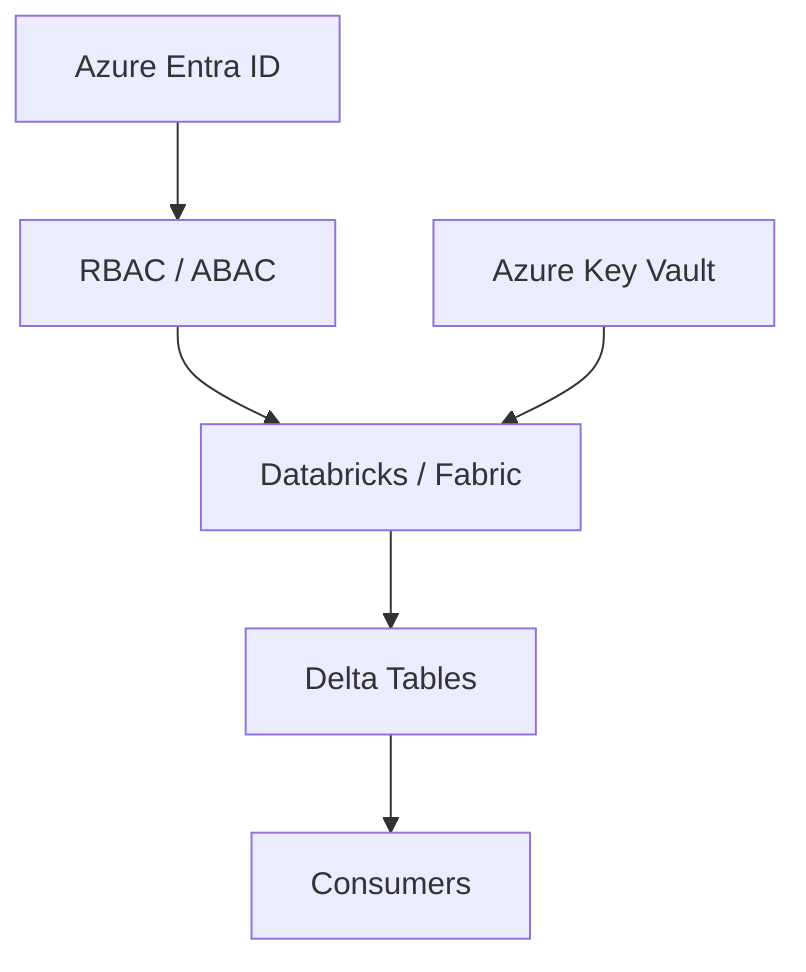
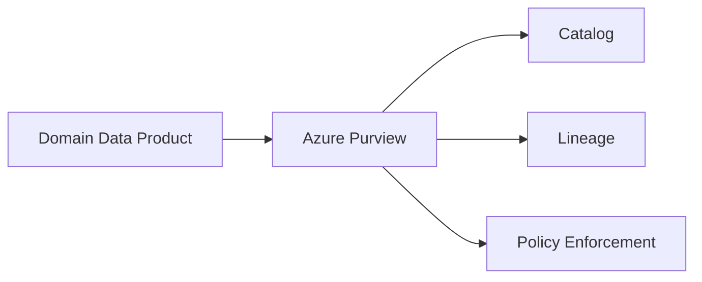
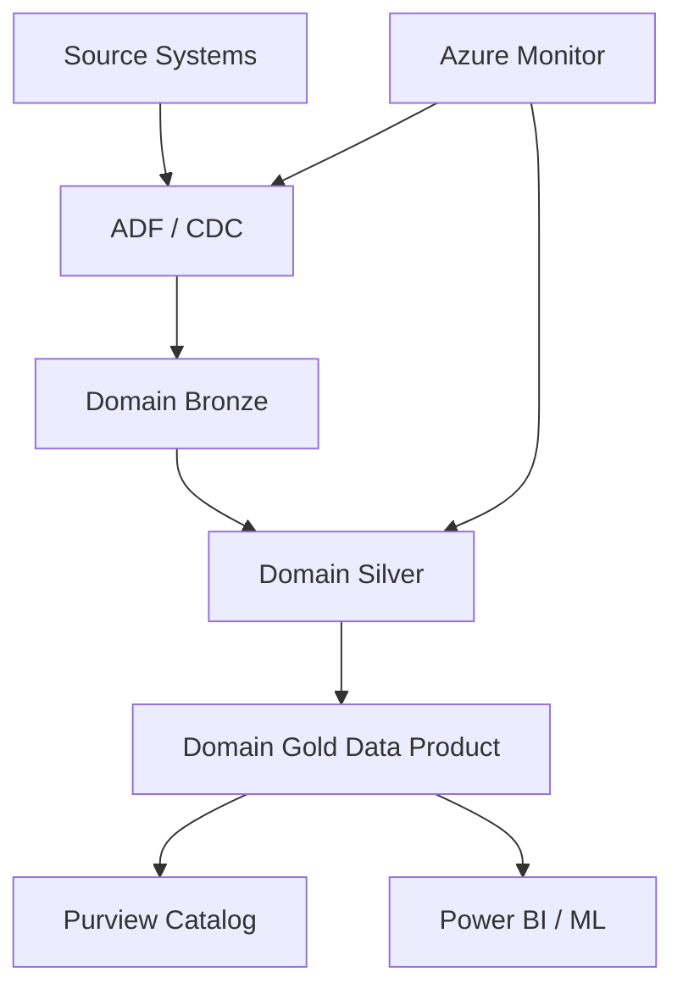

# Data Mesh Architecture (Domain-Oriented) – Detailed Explanation

---

## 1️⃣ What Is Data Mesh?

**Data Mesh** is a **socio-technical architecture paradigm** that treats **data as a product** and **decentralizes data ownership** to **business domains**, while providing a **central self-service data platform** and **federated governance**.

> Coined by **Zhamak Dehghani**, Data Mesh addresses the scaling problems of centralized data teams and monolithic data platforms.

---

## 2️⃣ Why Data Mesh Was Needed

### Problems with Centralized Data Platforms

| Problem                  | Impact                |
| ------------------------ | --------------------- |
| Central bottleneck team  | Slow delivery         |
| Lack of domain context   | Poor data quality     |
| Monolithic pipelines     | Fragile systems       |
| Low data ownership       | Blame culture         |
| Hard to scale org + tech | Missed business value |

### Data Mesh Solves

* Organizational scaling
* Faster time-to-insight
* Clear accountability
* Domain-aligned data quality

---

## 3️⃣ Core Principles of Data Mesh (4 Pillars)

---

### 3.1 Domain-Oriented Decentralized Ownership

* Data ownership lies with **domain teams**
* Domains align with business boundaries

**Examples**

* Sales
* Finance
* Customer
* Supply Chain

Each domain:

* Builds
* Owns
* Publishes
* Maintains its data products

---

### 3.2 Data as a Product

Each dataset is a **data product**, not a pipeline artifact.

**Data Product Must Have**

* Clear purpose
* Defined consumers
* SLA & SLOs
* Documentation
* Quality guarantees
* Versioning

---

### 3.3 Self-Service Data Platform

Central platform team provides:

* Ingestion frameworks
* Storage
* Compute
* CI/CD
* Observability
* Security primitives

> Domains focus on **business logic**, not infrastructure.

---

### 3.4 Federated Computational Governance

* Governance is **shared**, not centralized
* Standards enforced **programmatically**
* Policies embedded in pipelines

---

## 4️⃣ High-Level Data Mesh Architecture

### Diagram – Conceptual View

---

## 5️⃣ Data Product – Deep Dive

### What Is a Data Product?

A **data product** is a **fully owned, discoverable, trustworthy dataset** designed for consumption.

### Data Product Contract

| Element  | Description                |
| -------- | -------------------------- |
| Owner    | Domain team                |
| Schema   | Versioned & documented     |
| Quality  | Validations & expectations |
| SLAs     | Freshness, availability    |
| Security | Access policies            |
| Lineage  | Source → Consumer          |

---

### Diagram – Data Product Lifecycle

---

## 6️⃣ Domain Team Responsibilities

Each domain team acts as a **mini data team**.

### Roles

| Role               | Responsibility          |
| ------------------ | ----------------------- |
| Domain Data Owner  | Business accountability |
| Analytics Engineer | Data modeling           |
| Data Engineer      | Pipelines               |
| Product Owner      | Consumer needs          |
| QA                 | Data quality            |

---

## 7️⃣ Self-Service Data Platform (What Platform Team Provides)

### Platform Capabilities

| Layer         | Examples                 |
| ------------- | ------------------------ |
| Ingestion     | CDC templates, streaming |
| Storage       | Lakehouse                |
| Compute       | Spark, SQL engines       |
| Governance    | Catalog, lineage         |
| CI/CD         | Pipeline templates       |
| Observability | Data health              |
| Security      | IAM, encryption          |

---

### Diagram – Platform vs Domain Split

---

## 8️⃣ Federated Governance Model

### Governance Is:

* Automated
* Embedded
* Enforced by code

### Governance Domains

| Area             | Enforcement   |
| ---------------- | ------------- |
| Schema standards | CI checks     |
| PII handling     | Policy engine |
| Data quality     | Expectations  |
| Access control   | ABAC / RBAC   |
| Lineage          | Mandatory     |

---

### Diagram – Federated Governance

---

## 9️⃣ Data Mesh vs Lakehouse vs Data Warehouse

| Aspect      | Data Mesh         | Lakehouse | Data Warehouse |
| ----------- | ----------------- | --------- | -------------- |
| Ownership   | Decentralized     | Central   | Central        |
| Data Model  | Domain-specific   | Unified   | Schema-first   |
| Scalability | Org + Tech        | Tech      | Limited        |
| Governance  | Federated         | Central   | Central        |
| Best For    | Large enterprises | Most orgs | Reporting      |

> **Important:**
> **Data Mesh is an operating model**, not a replacement for Lakehouse.
> 👉 Data Mesh **runs ON TOP OF a Lakehouse**.

---

## 10️⃣ Real-World Use Cases

### Banking

* Domains: Payments, Loans, Risk
* Each publishes governed data products

### Retail

* Domains: Sales, Inventory, Customer
* Enables faster analytics per region

### Telecom

* Domains: Network, Billing, Usage
* High-volume, domain-specific datasets

### FMCG / Manufacturing

* Domains: Supply Chain, Quality, Sales

---

## 11️⃣ When to Use Data Mesh (Decision Guide)

### Use Data Mesh If:

* Organization has **multiple domains**
* Data team is a **bottleneck**
* Strong platform maturity
* Governance automation exists

### Avoid If:

* Small team
* Early data maturity
* No DevOps or platform team
* Weak data culture

---

## 12️⃣ Common Pitfalls & How to Avoid Them

| Pitfall                   | Solution               |
| ------------------------- | ---------------------- |
| Too much decentralization | Strong platform        |
| Inconsistent standards    | Automated governance   |
| Duplicate data products   | Catalog & reuse        |
| Skill gap in domains      | Enablement & templates |
| Overengineering           | Start small            |

---
---

# 1️⃣ Azure Data Mesh – Reference Architecture

## 1.1 Conceptual Mapping (Data Mesh → Azure Services)

| Data Mesh Concept     | Azure Implementation            |
| --------------------- | ------------------------------- |
| Domain ownership      | Business-aligned teams          |
| Data Product          | Delta tables / Fabric Lakehouse |
| Self-service platform | ADLS Gen2 + Databricks / Fabric |
| Federated governance  | Purview + Unity Catalog         |
| Observability         | Azure Monitor + Log Analytics   |
| Security              | Entra ID + RBAC + Key Vault     |

---

## 1.2 Azure Data Mesh – Logical Architecture

### Key Characteristics

* **Single Lakehouse platform**
* **Multiple domain-owned data products**
* **Central platform team**
* **Federated governance**

---

### 🧩 Azure Data Mesh – Diagram

---

## 1.3 Responsibilities Split (Critical for Success)

### Platform Team

* ADLS Gen2 provisioning
* Databricks / Fabric workspace
* CI/CD templates
* Security baseline
* Governance tooling

### Domain Teams

* Business logic
* Data modeling
* Data quality
* SLA ownership
* Data product lifecycle

---

# 2️⃣ Data Mesh + Lakehouse (Combined Architecture)

> ⚠️ **Important Architect Insight**

> **Data Mesh is NOT a replacement for Lakehouse.**

> 👉 **Data Mesh is an operating model**

> 👉 **Lakehouse is the technical foundation**

---

## 2.1 How They Work Together

* **One Lakehouse**
* **Multiple domain data products**
* **Medallion layers per domain**
* **Shared compute, isolated ownership**

---

## 2.2 Domain-Scoped Medallion Architecture

Each domain owns its **Bronze → Silver → Gold** independently.

### Example

* Sales domain gold ≠ Finance domain gold
* No global monolithic model

---

### 🧩 Data Mesh + Lakehouse – Diagram

---

## 2.3 Why This Works

✔ No duplicate pipelines

✔ Clear ownership

✔ Scales across teams

✔ Supports BI + ML

✔ Cost optimized

---

# 3️⃣ Security & Compliance in Azure Data Mesh

Security is **NOT centralized OR decentralized**

👉 It is **federated & automated**

---

## 3.1 Azure Data Mesh Security Layers

### 🔐 Identity & Access

* Azure Entra ID (AAD)
* RBAC at:

  * Storage account
  * Workspace
  * Table / schema

### 🔐 Data-Level Security

* Row-level security (RLS)
* Column masking
* Tokenization
* PII classification

---

### 🧩 Security Architecture – Diagram

---

## 3.2 Federated Governance with Azure Purview

### What Purview Governs

| Area           | Enforcement            |
| -------------- | ---------------------- |
| Data discovery | Mandatory registration |
| Lineage        | Auto-captured          |
| Classification | PII, PHI               |
| Policy         | Access rules           |
| Audit          | Compliance reports     |

---

### 🧩 Governance Flow – Diagram

---

## 3.3 Compliance by Design (Enterprise Grade)

### Supported Standards

* GDPR
* HIPAA
* ISO 27001
* SOC 2

### How Compliance Is Achieved

* Encryption at rest (ADLS Gen2)
* Encryption in transit (TLS)
* Private endpoints
* Audit logs
* Data retention policies

---

## 3.4 Data Product Security Contract

Each domain data product must define:

| Security Aspect | Example                                                 |
| --------------- | ------------------------------------------------------- |
| Owner           | [sales-data@company.com](mailto:sales-data@company.com) |
| Classification  | Confidential                                            |
| Access          | Role-based                                              |
| Masking         | Email, Phone                                            |
| Retention       | 7 years                                                 |
| SLA             | 99.9%                                                   |

---

# 4️⃣ End-to-End Secure Azure Data Mesh Flow

### 🧩 Complete Flow – Diagram

---

# 5️⃣ When Azure Data Mesh Is the Right Choice

### Ideal For:

* Large enterprises
* Multiple business domains
* Strong DevOps culture
* Regulatory environments
* Self-service analytics at scale

### Not Ideal For:

* Small teams
* Early data maturity
* No platform engineering team

---