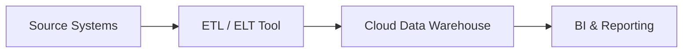
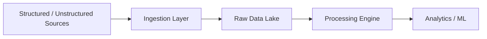
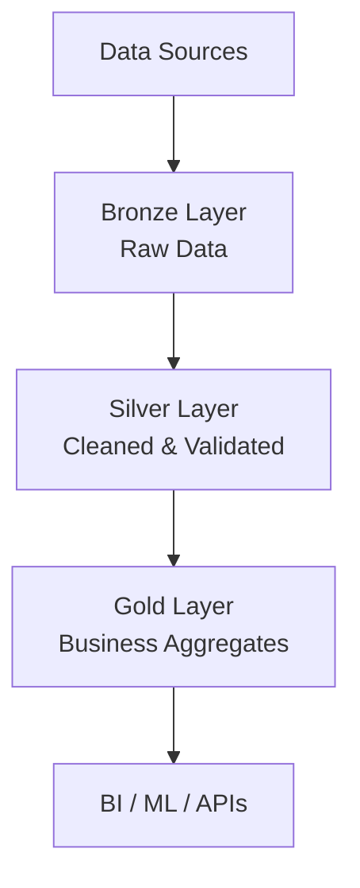
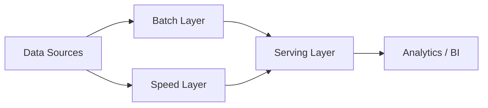
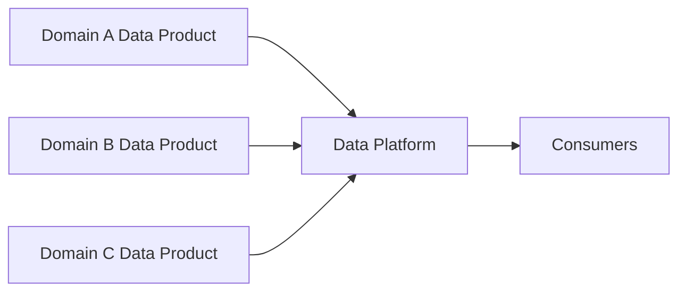
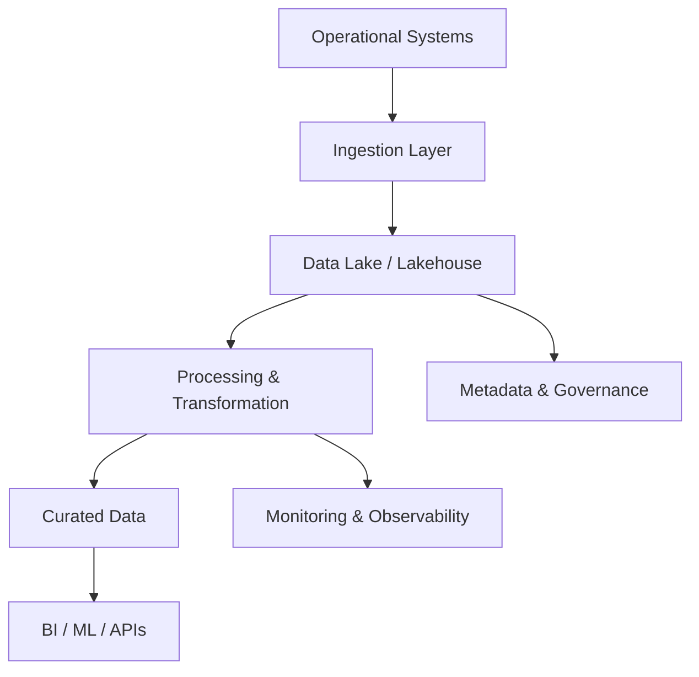

# Modern Data Architecture (MDA) 

## 1️⃣ What is Modern Data Architecture?

**Modern Data Architecture** is a scalable, cloud-native (or hybrid) data design that supports:

* High-volume & high-velocity data
* Structured, semi-structured, and unstructured data
* Batch + streaming processing
* Analytics, BI, ML, and AI workloads
* Governance, security, and compliance by design

### Why Traditional Architecture Failed

| Traditional DW | Modern Data       |
| -------------- | ----------------- |
| Schema-first   | Schema-on-read    |
| Batch only     | Batch + Streaming |
| Rigid scaling  | Elastic scaling   |
| Costly         | Pay-as-you-use    |
| Limited AI     | AI/ML-native      |

---

## 2️⃣ Core Principles of Modern Data Architecture

1. **Decoupled storage & compute**
2. **Open data formats (Parquet, Delta, Iceberg)**
3. **Event-driven & streaming support**
4. **Metadata & governance-first**
5. **Security-by-design**
6. **Self-service analytics**
7. **Cost optimization**

---

## 3️⃣ Key Components of Modern Data Architecture

### 3.1 Data Sources

* OLTP Databases (SQL Server, Oracle, MySQL)
* SaaS (SAP, Salesforce)
* Files (CSV, JSON, XML)
* IoT & Events
* APIs & Logs

---

### 3.2 Ingestion Layer

**Purpose:** Move data reliably into the platform.

**Types**

* Batch ingestion
* Streaming ingestion
* CDC (Change Data Capture)

**Tools**

* Azure Data Factory / Airflow
* Kafka / Event Hub
* Debezium (CDC)
* NiFi

---

### 3.3 Storage Layer (Data Lake / Lakehouse)

**Single source of truth**

**Zones**

* Raw / Bronze
* Cleaned / Silver
* Curated / Gold

**Formats**

* Parquet
* Delta Lake
* Apache Iceberg

---

### 3.4 Processing & Transformation

* ETL / ELT
* Batch & Streaming
* Data quality & validation

**Tools**

* Spark / Databricks
* Flink
* SQL engines

---

### 3.5 Analytics & Consumption

* BI dashboards
* Ad-hoc SQL
* ML models
* APIs

**Tools**

* Power BI / Tableau
* Trino / Presto
* MLflow

---

### 3.6 Governance, Security & Metadata

* Data catalog
* Lineage
* RBAC / ABAC
* Encryption
* Masking

---

### 3.7 Orchestration & Monitoring

* Workflow orchestration
* Data observability
* Alerting

---

## 4️⃣ Types of Modern Data Architectures (with MD Diagrams)

---

## 4.1 Modern Data Warehouse Architecture

### Use Case

* Business reporting
* Historical analytics
* KPI dashboards

### Architecture Flow

* Ingest → Transform → Load → BI

### MD Diagram

### Real-World Example

* Retail sales reporting
* Finance P&L dashboards

---

## 4.2 Data Lake Architecture

### Use Case

* Store raw & unstructured data
* Data science & exploration

### Architecture Flow

* Ingest → Store → Process → Consume

### MD Diagram

### Real-World Example

* Log analytics
* IoT telemetry data

---

## 4.3 Lakehouse Architecture (Most Popular)

### Why Lakehouse?

Combines **Data Lake + Data Warehouse**

* ACID transactions
* BI + ML on same data
* Lower cost

### Medallion Architecture

* Bronze → Silver → Gold

### MD Diagram

### Real-World Example

* Financial analytics
* Enterprise reporting + ML

---

## 4.4 Streaming / Real-Time Data Architecture

### Use Case

* Fraud detection
* Real-time dashboards
* Event-driven systems

### Architecture Flow

* Event → Stream → Process → Serve

### MD Diagram

### Real-World Example

* Payment fraud detection
* Stock price monitoring

---

## 4.5 Lambda Architecture

### Purpose

Handles **batch + real-time** together

### Layers

* Batch layer
* Speed layer
* Serving layer

### MD Diagram

### Drawback

* High complexity
* Duplicate logic

---

## 4.6 Kappa Architecture

### Improvement over Lambda

* Streaming-first
* Single processing pipeline

### MD Diagram

### Real-World Example

* Event-driven microservices
* Clickstream analytics

---

## 4.7 Data Mesh Architecture (Domain-Oriented)

### Key Concept

* Decentralized ownership
* Domain-driven data products

### MD Diagram

### Real-World Example

* Large enterprises (banking, FMCG)
* Multiple business domains

---

## 5️⃣ End-to-End Modern Data Architecture (Reference)

### MD Diagram

---

## 6️⃣ Real-World Industry Usage Mapping

| Industry      | Architecture Used       |
| ------------- | ----------------------- |
| Banking       | Lakehouse + Streaming   |
| Retail        | Lakehouse + DW          |
| Healthcare    | Secure Data Lake        |
| Telecom       | Streaming + Kappa       |
| Manufacturing | IoT Streaming Lakehouse |
| E-commerce    | Lambda → Kappa          |

---

## 7️⃣ Key Interview Takeaways (Architect Level)

* **Lakehouse is the default modern choice**
* **Streaming is mandatory for real-time use cases**
* **Governance is not optional**
* **Metadata-driven design is critical**
* **Cost optimization comes from decoupling compute & storage**

---
