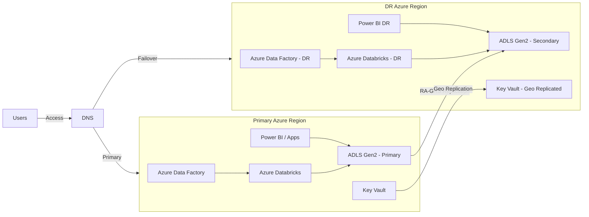

# Azure Disaster Recovery (DR) Questions & Answers
---

# 🧠 PART 1: 100+ Azure Disaster Recovery (DR) Questions & Answers

*(Data Platform | ADF | ADLS | Databricks | Enterprise Architecture)*

---

## 🔹 SECTION A: DR Fundamentals (Q1–Q15)

**Q1. What is Disaster Recovery (DR)?**
**A:** DR is a set of policies and procedures to restore IT systems and data after a catastrophic failure with defined RTO and RPO.

**Q2. DR vs High Availability (HA)?**
**A:**

* HA → short outages, same region
* DR → regional failures, cross-region recovery

**Q3. What is RTO?**
**A:** Maximum acceptable downtime after failure.

**Q4. What is RPO?**
**A:** Maximum acceptable data loss measured in time.

**Q5. Who defines RTO/RPO?**
**A:** Business stakeholders, not IT.

**Q6. What is regional DR?**
**A:** Recovery using Azure paired regions.

**Q7. What is zonal DR?**
**A:** Uses availability zones within a region.

**Q8. What is failover?**
**A:** Switching workloads to DR region.

**Q9. What is failback?**
**A:** Returning workloads to primary region.

**Q10. Cold vs Warm vs Hot DR?**
**A:**

* Cold → infra rebuilt
* Warm → infra ready, idle
* Hot → fully running (costly)

**Q11. What DR model is most common in data platforms?**
**A:** Active–Passive (Warm).

**Q12. Why DR testing is critical?**
**A:** Untested DR plans usually fail in real incidents.

**Q13. DR for data platforms is harder because?**
**A:** Data consistency, schema, pipelines, and metadata.

**Q14. What is blast radius?**
**A:** Scope of impact of a failure.

**Q15. DR should prioritize what?**
**A:** Business-critical data products.

---

## 🔹 SECTION B: ADLS DR (Q16–Q35)

**Q16. How does ADLS support DR?**
**A:** Via GRS / RA-GRS replication.

**Q17. Difference between GRS and RA-GRS?**
**A:**

* GRS → replicated, no read
* RA-GRS → read access to secondary

**Q18. Is ADLS replication synchronous?**
**A:** No, it is asynchronous.

**Q19. How do you protect against accidental deletes?**
**A:** Soft delete + versioning.

**Q20. How do you recover corrupted data?**
**A:** Delta time travel or blob version restore.

**Q21. How do ACLs behave in DR?**
**A:** ACLs replicate automatically.

**Q22. Can you manually promote secondary storage?**
**A:** Yes, during failover.

**Q23. What happens to endpoints after failover?**
**A:** Primary endpoint switches to secondary.

**Q24. How do you design multi-account DR?**
**A:** Separate storage accounts per region.

**Q25. How do you ensure data integrity post-failover?**
**A:** Checksums, row counts, reconciliation.

**Q26. What is immutable storage used for?**
**A:** Regulatory DR (WORM).

**Q27. Is lifecycle management replicated?**
**A:** Yes.

**Q28. How do you DR-proof folder structures?**
**A:** Avoid hard-coded paths.

**Q29. Can you replicate only some containers?**
**A:** No, replication is account-level.

**Q30. How do you test ADLS DR?**
**A:** Read-only validation from secondary.

**Q31. What is storage account failover time?**
**A:** Typically minutes to hours.

**Q32. What is the biggest ADLS DR risk?**
**A:** Data lag due to async replication.

**Q33. How do you design RPO < 15 minutes?**
**A:** Continuous ingestion + Delta checkpoints.

**Q34. How do you log storage access during DR?**
**A:** Azure Monitor & diagnostic logs.

**Q35. Best practice for ADLS DR?**
**A:** RA-GRS + Delta + automation.

---

## 🔹 SECTION C: Azure Data Factory DR (Q36–Q55)

**Q36. Is ADF state replicated automatically?**
**A:** No.

**Q37. How do you recover ADF?**
**A:** ARM templates + Git.

**Q38. Should DR ADF run in parallel?**
**A:** No, triggers must be disabled.

**Q39. How do you back up ADF pipelines?**
**A:** Git repository.

**Q40. What is ADF DR strategy?**
**A:** Re-deploy, reconfigure, re-trigger.

**Q41. How do you handle linked services in DR?**
**A:** Parameterized endpoints.

**Q42. How do you avoid duplicate loads?**
**A:** Watermark control tables.

**Q43. Where should control tables live?**
**A:** Geo-replicated SQL / Delta.

**Q44. What is the biggest ADF DR challenge?**
**A:** State & trigger coordination.

**Q45. Can ADF triggers replicate?**
**A:** No.

**Q46. How do you DR-enable schedules?**
**A:** Enable only after validation.

**Q47. How do you test ADF DR?**
**A:** Dry-run with triggers disabled.

**Q48. What is failover checklist for ADF?**
**A:** Disable primary → deploy DR → enable DR.

**Q49. ADF vs Synapse pipelines for DR?**
**A:** Same DR approach.

**Q50. How do you log pipeline runs?**
**A:** Azure Monitor + Log Analytics.

**Q51. How do you notify failures during DR?**
**A:** Alerts + Logic Apps.

**Q52. Can ADF auto-failover?**
**A:** No.

**Q53. What is recommended DR deployment method?**
**A:** CI/CD only.

**Q54. What breaks DR most often?**
**A:** Hardcoded secrets.

**Q55. Best ADF DR practice?**
**A:** Git + ARM + automation.

---

## 🔹 SECTION D: Azure Databricks DR (Q56–Q80)

**Q56. Is Databricks state replicated?**
**A:** No.

**Q57. How do you recover Databricks?**
**A:** New workspace + Git + ADLS.

**Q58. Where does data live in Databricks?**
**A:** ADLS (decoupled storage).

**Q59. What should never store critical data?**
**A:** DBFS root.

**Q60. How do you DR notebooks?**
**A:** Databricks Repos.

**Q61. How do you DR jobs?**
**A:** Jobs API + IaC.

**Q62. How do you DR Unity Catalog?**
**A:** Azure-managed metastore.

**Q63. What about secrets?**
**A:** Geo-replicated Key Vault.

**Q64. How do you resume jobs?**
**A:** Re-deploy job definitions.

**Q65. What is Photon impact in DR?**
**A:** Performance only, not recovery.

**Q66. Can Databricks auto-failover?**
**A:** No.

**Q67. What is the most critical Databricks DR dependency?**
**A:** Storage availability.

**Q68. How do you validate Databricks DR?**
**A:** Run sample jobs.

**Q69. How do you handle streaming jobs?**
**A:** Checkpoints in replicated storage.

**Q70. What breaks streaming DR?**
**A:** Non-replicated checkpoints.

**Q71. How do you control cost in DR?**
**A:** Keep clusters stopped.

**Q72. How do you avoid duplicate processing?**
**A:** Idempotent writes.

**Q73. What is recommended workspace model?**
**A:** One workspace per region.

**Q74. Databricks DR RTO depends on?**
**A:** Workspace provisioning + job redeploy.

**Q75. What should be scripted?**
**A:** Everything.

**Q76. Can notebooks be manually exported?**
**A:** Yes, but not recommended.

**Q77. Best Databricks DR practice?**
**A:** Storage-first design.

**Q78. What is the biggest Databricks DR risk?**
**A:** Missing Git sync.

**Q79. What is DR readiness indicator?**
**A:** One-click redeploy.

**Q80. Architect golden rule?**
**A:** Compute is disposable, data is not.

---

## 🔹 SECTION E: DR Switching & Governance (Q81–Q100)

**Q81. What is DR switch runbook?**
**A:** Step-by-step recovery guide.

**Q82. Who authorizes DR switch?**
**A:** Business + IT leadership.

**Q83. What is DNS role in DR?**
**A:** Endpoint redirection.

**Q84. How do you avoid split-brain?**
**A:** Disable primary before enabling DR.

**Q85. What is DR drill?**
**A:** Planned failover test.

**Q86. How often to run DR drills?**
**A:** 2–4 times per year.

**Q87. How do you validate BI during DR?**
**A:** Report reconciliation.

**Q88. How do you manage security during DR?**
**A:** Same RBAC & identities.

**Q89. What is DR compliance evidence?**
**A:** Logs, drill reports.

**Q90. What happens after DR event?**
**A:** Root cause analysis.

**Q91. What is configuration drift?**
**A:** Env mismatch between regions.

**Q92. How do you avoid drift?**
**A:** Infrastructure as Code.

**Q93. What is DR success metric?**
**A:** Business continuity.

**Q94. Who owns DR documentation?**
**A:** Architecture team.

**Q95. DR cost optimization strategy?**
**A:** Warm DR.

**Q96. What is zero-data-loss DR?**
**A:** Near-zero RPO with replication.

**Q97. Why DR is not only technical?**
**A:** Requires business decisions.

**Q98. What is DR governance?**
**A:** Policies, audits, reviews.

**Q99. What breaks DR plans?**
**A:** Assumptions.

**Q100. One-line DR summary?**
**A:** *“If it’s not automated and tested, it doesn’t exist.”*

---

# 🏗️ PART 2: Azure Reference DR Architecture (Markdown Diagram)

You can paste this directly into **Markdown / GitHub / Azure DevOps Wiki**.

---
