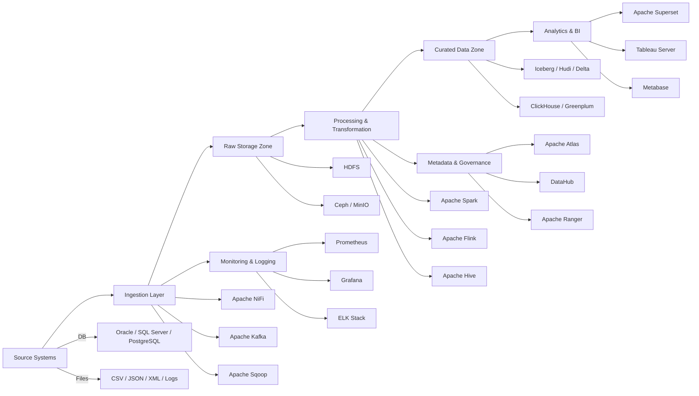

# 🏗️ On-Prem End-to-End Data Engineering Architecture

## 1. Architecture Overview

This architecture represents a **fully on-premises, open-source data platform** designed to ingest, process, store, and visualize enterprise data with high scalability, security, and governance—without using any cloud-native services.

---

## 2. High-Level Architecture Diagram (Mermaid)



---

## 3. Source Systems

**Data Producers**

* OLTP Databases: Oracle, SQL Server, PostgreSQL
* ERP Systems: SAP ECC / S4
* Flat Files: CSV, JSON, XML (FTP/SFTP)
* Logs & Events: Application logs, machine data

---

## 4. Data Ingestion Layer

**Batch Ingestion**

* Apache NiFi – Flow-based ingestion
* Apache Sqoop – RDBMS to HDFS

**Streaming Ingestion**

* Apache Kafka
* Kafka Connect

```text
Sources → NiFi / Sqoop → Kafka (optional)
```

---

## 5. Raw Storage (Landing Zone)

**Storage**

* HDFS (primary distributed storage)
* Ceph / MinIO (object storage)

**Characteristics**

* Immutable data
* Schema-on-read
* Partitioned by ingest date

```text
/raw/sales/ingest_date=2025-01-01/
```

---

## 6. Processing & Transformation Layer

**Compute Engines**

* Apache Spark (batch ETL)
* Apache Flink (streaming)
* Apache Hive (SQL transformations)

**Data Zones (Medallion)**

* **Bronze** – Raw data
* **Silver** – Cleaned & validated
* **Gold** – Aggregated & business-ready

---

## 7. Orchestration & Scheduling

**Tool**

* Apache Airflow

**Responsibilities**

* DAG scheduling
* Dependency management
* Retry & failure handling
* Alerts & notifications

```text
Ingest → Validate → Transform → Load → Publish
```

---

## 8. Curated Data & Analytics Layer

**Lakehouse Formats**

* Apache Iceberg
* Apache Hudi
* Delta Lake (Open Source)

**Analytical Stores**

* ClickHouse
* Greenplum
* Apache Druid / Pinot

---

## 9. Data Consumption & Visualization

**BI Tools (On-Prem)**

* Apache Superset
* Metabase
* Redash
* Tableau Server
* Qlik Sense

**Consumers**

* Business Analysts
* Data Scientists
* Reporting Applications

---

## 10. Metadata, Security & Governance

**Metadata & Lineage**

* Apache Atlas
* DataHub
* Amundsen

**Security**

* Kerberos – Authentication
* Apache Ranger – Authorization
* LDAP / Active Directory
* Encryption at rest & in transit

---

## 11. Monitoring & Operations

* Prometheus – Metrics
* Grafana – Dashboards
* ELK Stack – Log aggregation
* Airflow UI – Pipeline monitoring

---

## 12. End-to-End Data Flow Summary

```text
Source Systems
   ↓
Ingestion (NiFi / Kafka)
   ↓
Raw Storage (HDFS)
   ↓
Processing (Spark / Flink)
   ↓
Curated Storage (Iceberg / ClickHouse)
   ↓
BI & Analytics (Superset / Tableau)
```

---

## 13. Key Benefits

✅ Fully on-prem & open-source
✅ Horizontally scalable
✅ Strong governance & security
✅ Suitable for regulated industries
✅ Cloud-independent

---

